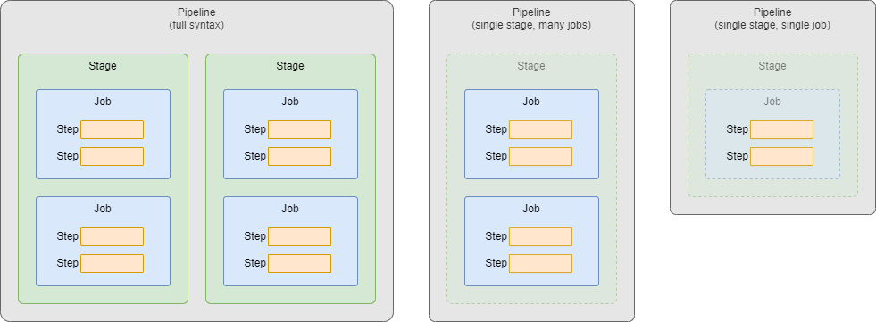

**Warning**: This is an advanced guide and assumes you already know the basics of Azure DevOps Pipelines. Think of this more like an advanced cheat sheet. I went through various sources, captured any notes that I felt were important, and organized them into the README file you see here. If you are new to ADO Pipelines, then I would suggest going through the Microsoft Docs or doing a couple Microsoft Learn courses first.

It's important to know that this is a live document. Some of the sections are still a work in progress. I will be continually updating it over time.

Azure DevOps has two different types of Pipelines.  First, there is the "*Classic UI*" Pipelines, these come in both Build and Release forms.  Second, there are the YAML Pipelines that are defined strictly in code.  This guide will only focus on the modern YAML Pipelines.

---

# High-Level Pipeline Structure

There are two main types of information defined in a YAML Pipeline:
- Pipeline-level information. This includes things like triggers, parameters, variables, agent pools, repositories, etc.
- The actual work being done by the Pipeline.  There are three different ways you can define the work:
  
  - The standard way by defining `Stages`, `Jobs`, and `Steps`.  This way will always work, no matter how many Stages or Jobs you have.
  - If you have one Stage with multiple Jobs, then you can omit the `Stages` layer.  So, all you need to define is `Jobs` and `Steps`.
  - If you have one Stage with one Job, then you can omit both the `Stages` and `Jobs` layer.  So, all you need to define is `Steps`.

---

# Pipeline-level information

Let's start by going over the common fields that can be defined at the root of the Pipeline, they are:
- [name](#name)
- [appendCommitMessageToRunTime](#appendcommitmessagetorunname)
- [trigger](#trigger-aka-ci-trigger)
- [pr](#pr-aka-pr-trigger)
- [schedules](#schedules-aka-scheduled-trigger)
- [parameters](#parameters-aka-runtime-parameters)
- [variables](#variables)
- [pool](#pool)
- resources
- lockBehavior

---

## name
- Specifies the name to use for each "Run" of this pipeline
- Not to be confused with the actual name of the pipeline itself (which is defined in the Azure DevOps UI)
- This field is optional.  The default name of each run will be in this format: `yyyymmdd.xx` where:
  - `yyyymmdd` is the current date
  - `xx` is an iterator, which starts at `1` and increments with each run of the pipeline
- This expects a string value, and expressions are allowed

---

## appendCommitMessageToRunName
- Specifies if the latest Git commit message is appended to the end of the run name (specified above)
- This field is optional.  The default is `true`
- This expects a boolean value.  In Azure DevOps YAML, a boolean means any of the following: `true`, `y`, `yes`, `on`, `false`, `n`, `no`, `off`

---

## trigger (aka CI Trigger)
- Specifies the Continuous Integration (CI) triggers that will be used to automatically start a run of this pipeline
- This looks for pushes to branches/tags on the repo where the pipeline's YAML file is stored
- This field is optional.  By default, a push to any branch of the repo will cause a pipeline run to be triggered
- You cannot use variables in `triggers`, as variables are not evaluated until after the pipeline triggers
- `triggers` is not supported inside template files
- There are 3 ways to define `triggers`:

### Option 1 - Disable CI Triggers
```yaml
trigger: 'none'
```
- Pushes to branches will not trigger a pipeline run

### Option 2 - Simplified Branch Syntax
```yaml
trigger:
- main
- feature/*
```
- This lets you specify a list of branch names, and wildcards are supported
- Any push to any of these branches will trigger a pipeline run

### Option 3 - Full Syntax
```yaml
trigger:
  batch: boolean
  branches:
    include:
    - main
    exclude:
    - feature/*
    - release/*
  paths:
    include:
    - docs/readme.md
    - docs/app*
    exclude:
    - .gitignore
    - docs
  tags:
    include:
    - v2.*
    exclude:
    - v3.0
```
- `batch` is optional, the default is `false`
  - Enabling the `batch` option means only one instance of the pipeline will run at a time.  While the second run of the pipeline is waiting for its turn, it will batch up all of the changes that have been made while its been waiting, and when its finally able to run it will apply all of those changes at once
- If you specify both `branches` and `tags` then both will be evaluated, if at least one of them matches, then the pipeline will be triggered
- `paths` is optional, the default is the root of the repo
  - `paths` cannot be used by itself, it can only be used in combination with `branches`
  - Paths in Git are case-sensitive, and wildcards are supported

---

## pr (aka PR Trigger)
- Specifies the Pull Request (PR) triggers that will be used to automatically start a run of this pipeline
- This looks for Pull Requests that are opened on branches of the repo where the pipeline's YAML file is stored
- This field is optional.  By default, a PR opened on any branch of the repo will cause a pipeline run to be triggered
- YAML PR triggers are only supported for GitHub and BitBucket Cloud
- You cannot use variables in `pr`, as variables are not evaluated until after the pipeline triggers
- `pr` is not supported inside template files
- There are 3 ways to define `pr`:

### Option 1 - Disable PR Triggers
```yaml
pr: 'none'
```
- Pull Requests on branches will not trigger a pipeline run

### Option 2 - Simplified Branch Syntax
```yaml
pr:
- main
- feature/*
```
- This lets you specify a list of branch names, and wildcards are supported
- Any Pull Reqeust on any of these branches will trigger a pipeline run

### Option 3 - Full Syntax
```yaml
pr:
  autoCancel: boolean
  drafts: boolean
  branches:
    include:
    - main
    exclude:
    - feature/*
    - release/*
  paths:
    include:
    - docs/readme.md
    - docs/app*
    exclude:
    - .gitignore
    - docs
```
- `autoCancel` is optional, the default is `true`
  - If more updates are made to the same PR, should in-progress validation runs be canceled?
- `drafts` is optional, the default is `true`
  - Will 'draft' PRs cause the trigger to fire?
- `paths` is optional, the default is the root of the repo
  - `paths` cannot be used by itself, it can only be used in combination with `branches`
  - Paths in Git are case-sensitive, and wildcards are supported

---

## schedules (aka Scheduled Trigger)
- Scheduled triggers configure a pipeline to run on a schedule, which is defined using cron syntax
- `schedules` is optional, by default no scheduled runs will occur
- Schedules can be defined in two places: the Azure DevOps UI and in YAML.  If schedules are defined in both places, the ones in Azure DevOps UI will take precedence
- You cannot use variables in `schedules`
- `schedules` is not supported inside template files

Syntax
```yaml
schedules:
- cron: string
  displayName: string
  batch: boolean
  always: boolean
  branches:
    include:
    - main
    exclude:
    - feature/*
    - release/*
```
- `cron` defines the cron syntax of this schedule
  - Only the UTC timezone is supported
- `batch` is optional, the default is `false`
  - Run a scheduled pipeline, even if the previously scheduled run is still in progress?
- `always` is optional, the default is `false`
  - Run the scheduled pipeline, even if there were no source code changes since the last scheduled run?

---

## parameters (aka Runtime Parameters)
- `parameters` defined at the pipeline-level are considered 'Runtime Parameters'
- When you manually run the pipeline from the Azure DevOps UI, you will be able to select/enter values for each parameter
- `parameters` is optional, and if omitted, your pipeline simply won't use any Runtime Parameters
- Parameters are expanded early in the processing of a pipeline run, so not all variables will be available to use within parameters. More [here](https://learn.microsoft.com/en-us/azure/devops/pipelines/build/variables?view=azure-devops&tabs=yaml)

Syntax
```yaml
parameters:
- name: string
  displayName: string
  type: string
  default: 'someValue'
  values:
  - 'first allowed value'
  - 'second allowed value'
```
- `name` is required
  - This is what you use to reference this parameter inside your YAML code
- `displayName` is optional, the default is what is specified for `name`
  - This is a human-readable name you can give to the parameter
  - This is how the parameters appears in the Azure DevOps UI when you run the pipeline manually
- `type` is required, possible options are:
  - `boolean`, `number`, `object`, `string`
  - `environment`, `filePath`, `pool`, `secureFile`, `serviceConnection`
  - `container`, `containerList`, `deployment`, `deploymentList`, `job`, `jobList`, `stage`, `stageList`, `step`, `stepList`
- If a Parameter is defined, it cannot be optional, meaning you must provide a value when running the pipeline manually, or it must be configured with a `default` value. If neither of those are supplied, then the first value from the allowed `values` list will be used

---

## variables
- This lets you specify variables that can be used throughout your pipeline
- `variables` is optional, and if omitted, your pipeline simply won't have any pipeline-level variables (they could still be defined at other levels though)

General info:
- Variable names must contain only letters, numbers, periods, or underscores
  - Variable names must not begin with these words (regardless of capitalization): `endpoint`, `input`, `path`, `secret`, `securefile`
- Variables don't have a type, all variables are stored as strings
- Variables are mutable, the value can change from run to run, or from job to job (but you can override this with the `readonly` option)

Variables can be defined at multiple places throughout your pipeline:
  - When you define a variable with the same name in multiple places, the most specific place wins
  - The places, in order from least specific to most specific:
    - Azure DevOps UI
    - YAML pipeline-level (what we're discussing here)
    - YAML stage-level
    - YAML job-level

Azure DevOps comes with many system variables, these have predefined values that are read-only. More [here](https://learn.microsoft.com/en-us/azure/devops/pipelines/build/variables?view=azure-devops&tabs=yaml)

User-defined and System variables are both automatically converted to environment variables on the pipeline agent:
- OS-specific environment variable naming standards:
  - Mac and Linux: `$NAME`
  - Windows Batch: `%NAME%`
  - Windows PowerShell: `$env:NAME`
- When converting to environment variables:
  - Variable names are converted to uppercase
  - Any periods in the name are converted to underscores
- There are 2 ways to define `variables`.  You must pick only one, as you can't mix both styles:

### Option 1 - Mapping Syntax
This is just simple key/value pairs
```yaml
variables:
  varName1: 'value1'
  varName2: 'value2'
  varName3: 'value3'
```
- This is considered the shortcut syntax
- Does not support Variable Groups, Variable Templates, or setting a variable to read-only

### Option 2 - List Syntax
```yaml
variables:
- name: 'varName1'
  value: 'value1'
  readonly: boolean
- group: 'varGroupName' # use a variable group
- template: 'templateFile' # use a variable template
  parameters:
    param1: 'value1'
    param2: 'value2'
```
- This is considered the full syntax allowing you all possible options
- `readonly` is optional, the default is `false`

---

## pool
- This lets you specify the type of agent that will be used to run all jobs within your pipeline
- `pool` is optional, and if omitted, your YAML pipeline will default to using `ubuntu-latest`
- `pool` can be defined at multiple places throughout your pipeline:
  - When you define a `pool` in multiple places, the most specific place wins
  - The places, in order from least specific to most specific:
    - YAML pipeline-level (what we're discussing here)
    - YAML stage-level
    - YAML job-level
- There are 4 ways to define `pool`:

### Option 1 - Use self-hosted agents with no demands
```yaml
pool: 'privatePoolName'
```

### Option 2 - Use self-hosted agents with a single demand
```yaml
pool:
  name: 'privatePoolName'
  demands: 'singleDemand'
```

### Option 3 - Use self-hosted agents with multiple demands
```yaml
pool:
  name: 'privatePoolName'
  demands:
  - 'firstDemand'
  - 'secondDemand'
```

### Option 4 - Use Microsoft-hosted agents
```yaml
pool:
  vmImage: 'ubuntu-latest'
```


---

1. stages
2. jobs
3. steps
  - strategy
  - continueOnError
  - container
  - services
  - workspace
4. extends


---
Triggers
- Tells the Pipeline when to run

Stages
- A logical boundary that can be used to mark seperation of concerns (one example being Build, QA, Production)
- Stages are comprised of one or more Jobs (max of 256 Jobs per Stage)
- By default, Stages run sequentially, one after the other, in the order they are defined in the yaml file.
  - In other words, by default, each Stage has an implicit dependency on the previous Stage
  - If you add `dependsOn` to a Stage, then you can change the order in which the Stages run
  - If you add `dependsOn: []` to a Stage, this removes any dependencies altogether, so this Stage will run in parallel with others
- By default, a Stage will not run if the previous Stage fails
  - If you add a `condition` to a Stage, you can make it run even if the previous Stage fails
  - If you add any `condition` to a Stage, then you are removing the implicit condition that the previous Stage must succeed.  So, when you use a `condition` on a Stage it is common to use `and(succeeded(),yourCustomCondition)` which adds the implicit success condition back, as well as adds your own custom condition.  Otherwise, this Stage will run regardless of the outcoum of the preceding Stage.

Jobs
- Each Job runs on one Agent
  - Though, there are a handful of 'Agentless' Jobs as well
- Jobs are comprised of one or more Steps
- An Agent can only run one Job at a time
  - To run multiple Jobs in parallel you must have multiple Agents as well as purchase sufficient Parallel Jobs
  - If you have multiple Agents and don't want your Jobs running in parallel, then you can use `dependsOn` in your Jobs to make sure they run in the order you want them to
- Jobs are configured with a default timeout of 60 minutes
  - This can be configured by adding the `timeoutInMinutes` setting to your Job
  - Setting `timeoutInMinutes` will set the timeout to:
    - Forever on self-hosted Agents
    - 360 minutes / 6 hours on Microsoft-hosted Agents for a public project and public repo
    - 60 minutes / 1 hour on Microsoft-hosted Agents for a private project and private repo (but you can purchase more)
- 

Steps
- The smallest building block of a Pipeline
- Steps can run a Task
  - Tasks are pre-packaged scripts or procedures to do something (install Java, run a Gradle build, etc.)
  - Tasks abstract away a lot of the underlying complexity, and all you have to do is just provide a set of inputs to the Task
- Steps can also just run your own custom Script (command line, PowerShell, or Bash)

---

Environments
Agents
Artifacts

---

Conditions
- Conditions can be used on Stages, Jobs, or Steps

---

Templates
- Templates must exist on your filesystem at the start of a pipeline run
- You can't reference Templates in an artifact
- 1. Steps
- 2. Jobs
  - When templating Jobs, remember to remove the name of the Job inside your Template file, this will avoid any naming conflicts
- 3. Stages
- 4. Variables
- When referencing a Template, the path to use for the Template should be relative to the main yaml pipeline
- You can reference a Template that is in another repo than the main yaml pipeline
  - You must define the other repo in the 'resources' section in your main yaml pipeline
  - template: file.yaml@repoName
  - You can also reference the repo where the main yaml pipeline is found with 'self':
    template: file.yaml@self

---

`${{ Template Expressions }}`
- Can be used to expand Parameters or Variables
- Two formats:
  - Index Syntax: `${{ parameters['someName']`
  - Property Deference syntax: `${{ parameters.someName }}`
- Expansion only happens inside Stages, Jobs, Steps, or Resources\Containers
  - What about the new feature for Repos?

---

Sources
- https://learn.microsoft.com/en-us/azure/devops/pipelines/process/stages
- https://learn.microsoft.com/en-us/azure/devops/pipelines/process/phases
- https://learn.microsoft.com/en-us/azure/devops/pipelines/process/templates
- https://learn.microsoft.com/en-us/azure/devops/pipelines/process/expressions
- https://learn.microsoft.com/en-us/azure/devops/pipelines/process/conditions
