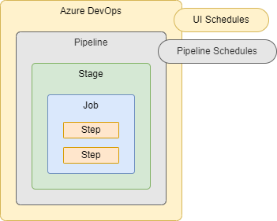
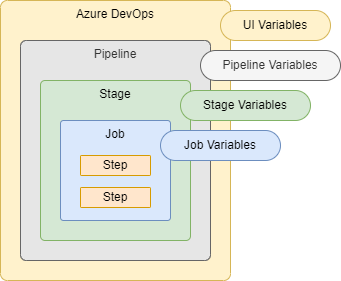
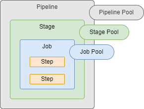
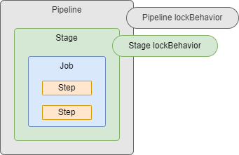

**Warning**: This is an advanced guide and assumes you already know the basics of Azure DevOps Pipelines. Think of this more like an advanced cheat sheet. I went through various sources, captured any notes that I felt were important, and organized them into the README file you see here. If you are new to ADO Pipelines, then I would suggest going through the Microsoft Docs or doing a couple Microsoft Learn courses first.

It's important to know that this is a live document. Some of the sections are still a work in progress. I will be continually updating it over time.

Azure DevOps has two different types of Pipelines.  First, there is the "*Classic UI*" Pipelines, these come in both Build and Release forms.  Second, there are the YAML Pipelines that are defined strictly in code.  This guide will only focus on the modern YAML Pipelines.

---

# Table of Contents

**Part 1 - Pipeline-level information**:
- [name](#name)
- [appendCommitMessageToRunTime](#appendcommitmessagetorunname)
- [trigger](#trigger-aka-ci-trigger)
- [pr](#pr-aka-pr-trigger)
- [schedules](#schedules-aka-scheduled-trigger)
- [parameters](#parameters-aka-runtime-parameters)
- [variables](#variables)
- [pool](#pool)
- [resources](#resources)
  - [builds](#resources-builds)
  - [containers](#resources-containers)
  - [packages](#resources-packages)
  - [pipelines](#resources-pipelines)
  - [repositories](#resources-repositories)
  - [webhooks](#resources-webhooks)
- [lockBehavior](#lockbehavior)

**Part 2 - Defining the work done by the Pipeline**:
- stages
- jobs
- steps

---

# Part 1 - Pipeline-level Information

## name
```yaml
name: string # the name to use for each 'run' of the pipeline. see more below
```
- Not to be confused with the actual name of the pipeline itself (which is defined in the Azure DevOps UI)
- This field is optional.  The default name of each run will be in this format: `yyyymmdd.xx` where:
  - `yyyymmdd` is the current date
  - `xx` is an iterator, which starts at `1` and increments with each run of the pipeline
- Expressions are allowed in the value in order to make the run name unique

## appendCommitMessageToRunName
```yaml
appendCommitMessageToRunName: boolean # is the latest Git commit message appended to the end of the run name? optional, default is true
```

## trigger (aka CI Trigger)
- Looks for pushes to branches and/or tags on the repo where the pipeline is stored
- This field is optional.  By default, a push to any branch of the repo will cause the pipeline to be triggered
- You cannot use variables in `triggers`, as variables are evaluated after triggers are evaluated
- `triggers` are not supported inside template files

There are 3 ways to define `triggers`:
```yaml
# Option 1 - Disable CI Triggers
trigger: 'none'

# Option 2 - Simplified Branch Syntax
trigger: # any push to any of these branches will trigger a pipeline run
- main
- feature/*

# Option 3 - Full Syntax
trigger:
  batch: boolean # see more below. optional, default is false
  branches:
    include:
    - main
    exclude:
    - feature/*
    - release/*
  paths: # see more below. optional, default is root of the repo
    include:
    - docs/readme.md
    - docs/app*
    exclude:
    - .gitignore
    - docs
  tags:
    include:
    - v2.*
    exclude:
    - v3.0
```
- `batch`: Setting this to true means only one instance of the pipeline will run at a time.  While the second run of the pipeline is waiting for its turn, it will batch up all of the changes that have been made while waiting, and when its finally able to run it will apply all of those changes at once
- If you specify both `branches` and `tags` then both will be evaluated.  If at least one of them matches, then the pipeline will be triggered
- `paths`: Cannot be used by itself, it can only be used in combination with `branches`
  - Paths in Git are case-sensitive

## pr (aka PR Trigger)
- Looks for Pull Requests that are opened on the repo where the pipeline is stored
- This field is optional.  By default, a PR opened on any branch of the repo will cause the pipeline to be triggered
- YAML PR triggers are only supported for GitHub and BitBucket Cloud
- You cannot use variables in `pr`, as variables are evaluated after triggers are evaluated
- `pr` is not supported inside template files

There are 3 ways to define `pr`:
```yaml
# Option 1 - Disable PR Triggers
pr: 'none'

# Option 2 - Simplified Branch Syntax
pr: # any Pull Request on any of these branches will trigger a pipeline run
- main
- feature/*

# Option 3 - Full Syntax
pr:
  autoCancel: boolean # if more updates are made to the same PR, should in-progress validation runs be canceled? optional, default is true
  drafts: boolean # will 'draft' PRs cause the trigger to fire? optional, default is true
  branches:
    include:
    - main
    exclude:
    - feature/*
    - release/*
  paths: # see more below. optional, default is root of the repo
    include:
    - docs/readme.md
    - docs/app*
    exclude:
    - .gitignore
    - docs
```
- `paths`: Cannot be used by itself, it can only be used in combination with `branches`
  - Paths in Git are case-sensitive

## schedules (aka Scheduled Trigger)
- `schedules` is optional, by default no scheduled runs will occur
- Schedules can be defined in two places: the Azure DevOps UI and in your pipeline's YAML.  If schedules are defined in both places, then only schedules in Azure DevOps UI will run<br />
- You cannot use variables in `schedules`, as variables are evaluated after triggers are evaluated
- `schedules` are not supported inside template files

Syntax
```yaml
schedules:
- cron: string # defines the cron syntax of this schedule in UTC time. must be the first property
  displayName: string
  batch: boolean # run a scheduled pipeline, even if the previously scheduled run is still in progress? optional, default is false
  always: boolean # run a scheduled pipeline, even if there were no source code changes since the last scheduled run? optional, default is false
  branches:
    include:
    - main
    exclude:
    - feature/*
    - release/*
```

## parameters (aka Runtime Parameters)
- `parameters` are optional, and if omitted, your pipeline simply won't use any Runtime Parameters

Defining `parameters`
```yaml
parameters:
- name: string # the symbolic name used to reference this parameter throughout your pipeline. required, must be the first property
  displayName: string # the human-readable name shown in the Azure DevOps UI. optional, default is same as name
  type: string # see more below. required
  default: 'someValue'
  values:
  - 'first allowed value'
  - 'second allowed value'
```
- Parameters must have a `type`, the accepted values are:
  - `boolean`, `number`, `object`, `string`
  - `environment`, `filePath`, `pool`, `secureFile`, `serviceConnection`
  - `container`, `containerList`, `deployment`, `deploymentList`, `job`, `jobList`, `stage`, `stageList`, `step`, `stepList`
- A parameter cannot be optional.  This means you must provide a value when running the pipeline manually, or the parameter must be configured with a `default` value. If neither of those are supplied, then the first value from the allowed `values` list will be used

Using Parameters
```yaml
# Option 1 - Template Expression
# processed once at compile time
# if the parameter doesn't exist, then it resolves to an empty string
# can be used in both YAML keys (left side) and YAML values (right side)
${{ parameters.varName }}    # index syntax
${{ parameters['varName'] }} # property deference syntax
```

## variables
`variables` are optional, and if omitted, your pipeline simply won't have any pipeline-level variables (they could still be defined at other levels though)

General info:
- Variable names must contain only letters, numbers, periods, or underscores
- Variable names must not begin with these words (regardless of capitalization): `endpoint`, `input`, `path`, `secret`, `securefile`
- Variables don't have a type, all variables are stored as strings
- Variables are mutable, the value can change from run to run, or from job to job (but you can override this with the `readonly` option)
- Azure DevOps uses many default system variables, and they all have predefined values that are read-only. More [here](https://learn.microsoft.com/en-us/azure/devops/pipelines/build/variables?view=azure-devops&tabs=yaml)

Variables can be defined at multiple places throughout your pipeline:<br />

  - When you define a variable with the same name in multiple places, the most specific place wins
  - The places, in order from least specific to most specific:
    - Azure DevOps UI
    - YAML pipeline-level (what we're discussing here)
    - YAML stage-level
    - YAML job-level

Both User-defined variables and System variables are automatically converted to environment variables inside the pipeline Agent:
- OS-specific environment variable naming standards:
  - Mac and Linux: `$NAME`
  - Windows Batch: `%NAME%`
  - Windows PowerShell: `$env:NAME`
- When pipeline variables are converted to environment variables:
  - Variable names are converted to uppercase
  - Any periods in the name are converted to underscores

There are 2 ways to define `variables`:
```yaml
# Option 1 - Mapping Syntax
# Does not support Variable Groups, Variable Templates, or setting a variable to read-only
variables:
  varName1: 'value1'
  varName2: 'value2'
  varName3: 'value3'

# Option 2 - List Syntax (full syntax)
variables:
- name: 'varName1'
  value: 'value1'
  readonly: boolean # optional, default is false
# specify a variable group
- group: 'varGroupName'
# specify a variable template
- template: 'templateFile'
  parameters:
    param1: 'value1'
    param2: 'value2'
```

Using Variables
```yaml
# Option 1 - Template Expression
# processed once at compile time
# if the variable doesn't exist, then it resolves to an empty string
# can be used in both YAML keys (left side) and YAML values (right side)
${{ variables.varName }}    # index syntax
${{ variables['varName'] }} # property deference syntax

# Option 2 - Macro Syntax
# processed at runtime, right before a task runs
# if the variable doesn't exist, then it is not changed and it will still say $(varName)
# only expanded when found in certain places, including: stages, jobs, steps, and some others
# can be used in YAML values (right side), but not in YAML keys (left side)
$(varName)

# Option 3 - Runtime Expression
# processed at runtime
# if the variable doesn't exist, then it resolves to an empty string
# can be used in YAML values (right side), but not in YAML keys (left side)
# must take up the entire right side of the YAML value
# meant to be used for conditions and expressions
$[ variables.varName ]    # index syntax
$[ variables['varName'] ] # property deference syntax
```

## pool
- This lets you specify the type of Agent that will be used to run all Jobs within your pipeline
- `pool` is optional, and if omitted, your YAML pipeline will default to using the Microsoft-hosted `ubuntu-latest`
- `pool` can be defined at multiple places throughout your pipeline:<br />
  - The most specific place wins
  - The places, in order from least specific to most specific:
    - YAML pipeline-level (what we're discussing here)
    - YAML stage-level
    - YAML job-level

There are 4 ways to define `pool`:
```yaml
# Option 1 - Use a self-hosted pool with no demands
pool: 'privatePoolName'

# Option 2 - Use a self-hosted pool with a single demand
pool:
  name: 'privatePoolName'
  demands: 'singleDemand'

# Option 3 - Use a self-hosted pool with multiple demands
pool:
  name: 'privatePoolName'
  demands:
  - 'firstDemand'
  - 'secondDemand'

# Option 4 - Use a Microsoft-hosted pool
pool:
  vmImage: 'ubuntu-latest'
```
- [List](https://learn.microsoft.com/en-us/azure/devops/pipelines/agents/hosted) of Microsoft-hosted agents

## resources
You can define builds, containers, packages, pipelines, repositories, and webhooks.  Each one of these resources can be consumed by your Pipeline, or used to trigger your Pipeline

### <ins>Resources: builds</ins>
These are artifacts produced by an external CI system

```yaml
resources:
  builds:
  - build: string # the symbolic name used to reference this artifact. required, must be the first property. accepts only letters, numbers, dashes, and underscores
    type: string # specifies the type of artifact. required. examples: Jenkins, circleCI
    connection: string # the Azure DevOps Service Connection used to communicate with the external CI system. required
    source: string # depends on the external CI system (for Jenkins this would be the Project name). required
    version: string # the build number from the external CI system. optional, default is latest successful build
    branch: string
    trigger: boolean # when this artifact is updated, is it allowed to trigger this pipeline? optional, default is none. accepts only none or true
```
- Triggers are only supported for hosted Jenkins, where Azure DevOps has line of sight with Jenkins server
- Build resources are not automatically downloaded by Jobs.  To consume Builds use a [downloadBuild](https://learn.microsoft.com/en-us/azure/devops/pipelines/yaml-schema/steps-download-build) Step or a [DownloadBuildArtifacts](https://learn.microsoft.com/en-us/azure/devops/pipelines/tasks/reference/download-build-artifacts-v1) Task

### <ins>Resources: containers</ins>
These are container images

```yaml
# define a container from Docker Registry
resources:
  containers:
  - container: string # the symbolic name used to reference this image. required, must be the first property. accepts only letters, numbers, dashes, and underscores
    image: string # required. examples: ubuntu:16.04, company.azurecr.io/repo:1.0.0
    endpoint: string # the Docker Service Connection used to communicate with the private registry
    env: # variables to map into the container's environment
      string: string
    mapDockerSocket: boolean # map the /var/run/docker.sock volume on container jobs? optional, default is true
    options: string # arguments to pass to the container at startup
    ports: # expose ports on the Container
    - '8080:80' # binds port 80 on the Container to port 8080 on the host Agent
    - '6380' # binds port 6380 on the Container to a random available port on the host Agent
    volumes: # mount volumes on the Container
    - '/src/dir1:/dst/dir2' # mount /src/dir1 from the host Agent to /dst/dir2 on the Container
    mountReadOnly: # which volumes should be mounted as read-only? optional, all 4 have default of false
      work: boolean # mount the work directory as readonly?
      externals: boolean # mount the externals directoy as readonly? these are components required to talk with the Agent
      tools: boolean # mount the tools directory as readonly? these are installable tools like Python and Ruby
      tasks: boolean # mount the tasks directory as readonly? these are tasks required by the job

# define a container from Azure Container Registry
resources:
  containers:
  - container: string # the symbolic name used to reference this image. required, must be the first property. accepts only letters, numbers, dashes, and underscores
    type: 'ACR'
    azureSubscription: string # the AzureRM Service Connection used to communicate with ACR
    resourceGroup: string # the Resource Group where the ACR is located
    registry: string # name of the registry in ACR
    repository: string # name of the repo in ACR
    env: # variables to map into the container's environment
      string: string
    mapDockerSocket: boolean # map the /var/run/docker.sock volume on container jobs? optional, default is true
    options: string # arguments to pass to the container at startup
    ports: # expose ports on the Container
    - '8080:80' # binds port 80 on the Container to port 8080 on the host Agent
    - '6380' # binds port 6380 on the Container to a random available port on the host Agent
    volumes: # mount volumes on the Container
    - '/src/dir1:/dst/dir2' # mount /src/dir1 from the host Agent to /dst/dir2 on the Container
    mountReadOnly: # which volumes should be mounted as read-only? optional, all 4 have default of false
      work: boolean # mount the work directory as readonly?
      externals: boolean # mount the externals directoy as readonly? these are components required to talk with the Agent
      tools: boolean # mount the tools directory as readonly? these are installable tools like Python and Ruby
      tasks: boolean # mount the tasks directory as readonly? these are tasks required by the job
    trigger: # if the container image is updated, will it trigger this pipeline? see more below. optional, default is none
```
- To consume a Container resource, use a Container Job, a Step Target, or a Service Container
- `trigger` might only work with ACR containers, the documentation is not crystal clear on this
- `trigger` options in depth:
  ```yaml
  # option 1 - Disable
  trigger: 'none'

  # option 2 - Trigger on all image tags (shortcut syntax)
  trigger: 'true'

  # option 3 - Trigger on all image tags (full syntax)
  trigger:
    enabled: 'true'

  # option 4 - Trigger on specific image tags
  trigger:
    enabled: 'true'
    tags:
      include:
      - 'ubuntu:16.04'
      exclude:
      - 'ubuntu:18.04'
  ```

### <ins>Resources: packages</ins>
These are nuget or npm packages stored on GitHub Packages

```yaml
resources:
  packages:
  - package: string # the symbolic name used to reference this package. required, must be the first property. accepts only letters, numbers, dashes, and underscores
    type: string # the type of the package. required. examples: nuget, npm
    connection: string # the Azure DevOps Service Connection used to communicate with GitHub. required
    name: string # the repo and name of the package. required. example: someRepo/somePackage
    version: string # the version of the package. optional, default is the latest version
    tag: string
    trigger: string # if the package is updated, will it trigger this pipeline? optional, default is none. accepts only none or true
```
- Package resources are not automatically downloaded by Jobs.  To consume Packages use a [getPackage](https://learn.microsoft.com/en-us/azure/devops/pipelines/yaml-schema/steps-get-package) Step or a [DownloadPackage](https://learn.microsoft.com/en-us/azure/devops/pipelines/tasks/reference/download-package-v1) Task

### <ins>Resources: pipelines</ins>
These are other Azure DevOps YAML Pipelines

```yaml
resources:
  pipelines:
  - pipeline: string # the symbolic name used to reference this other pipeline. required, must be the first property. accepts only letters, numbers, dashes, and underscores
    project: string # the azure devops project where this other pipeline is located. optional, default is the current azure devops project
    source: string # the name of this other pipeline
    trigger: # if the other pipeline is ran successfully, will it trigger this pipeline? see more below. optional, default is none
    # the next 3 options are used
    version: string # the run name from this other pipeline. optional, default is the latest successful run across all stages. this is used as a default for manual or scheduled triggers
    branch: string # branch to pick the artifact. optional, defaults to all branches. this is used as a default for manual or scheduled triggers
    tags: # List of tags required on the other pipeline. optional. this is used as a default for manual or scheduled triggers
    - string
```
- Pipeline resources are not automatically downloaded by 'regular' Jobs, but they are automatically downloaded by 'deploy' jobs.  To consume Pipeline resources in 'regular' Jobs use a [Download](https://learn.microsoft.com/en-us/azure/devops/pipelines/yaml-schema/steps-download) Step or a [DownloadPipelineArtifact](https://learn.microsoft.com/en-us/azure/devops/pipelines/tasks/reference/download-pipeline-artifact-v2) Task
- When an update to the Pipeline `resource` causes the parent Pipeline to trigger:
  - If the Pipeline `resource` and the parent Pipeline are from the same repository, and the Pipeline `resource` triggers because of an update to Branch A, then the parent Pipeline will be run using that same Branch A.
  - If the Pipeline `resource` and the parent Pipeline are from different repositories, then the parent Pipeline will always run using its own default Branch, it doesn't matter which branch the Pipeline `resource` was updated on
- `trigger` options in depth:
  ```yaml
  # option 1 - Disable
  trigger: 'none'

  # option 2 - Trigger on a successful run from all branches (shortcut syntax)
  trigger: 'true'

  # option 3 - Trigger on a successful run from a specific list of branches (simplified syntax)
  trigger:
    enabled: boolean # optional, default is true
    branches:
    - 'main'
    - 'feature/*'

  # option 4 - Full Syntax
  trigger:
    enabled: boolean # optional, default is true
    branches: # trigger on a successful run from a specific list of branches
      include:
      - 'main'
      exclude:
      - 'feature/*'
    tags: # list of tags that when matched will trigger the pipeline
    - 'three'
    stages: # list of Pipeline Stages that must be completed successfully
    - 'four'
  ```
  - `tags` are AND'ed, meaning all of the tags listed must be present
  - `stages` are AND'ed, meaning all of the stages listed must be successfully completed
  - If branches, tags, and stages are all defined, then all of them must be fully satisfied for the trigger to fire

### <ins>Resources: repositories</ins>
These are source code repositories

```yaml
resources:
  repositories:
  - repository: string  # the symbolic name used to reference this repo. required, must be the first property. accepts only letters, numbers, dashes, and underscores
    type: string  # the type of repo. accepts only git, github, githubenterprise, and bitbucket
    name: string  # the repository name, what you put here depends on the value of type. see more below
    ref: string  # the ref to checkout (branch, tag, etc.). optional, default is refs/heads/main
    endpoint: string  # the Azure DevOps Service Connection used to communicate with the repo
    trigger:  # if the repository is updated, will it trigger this pipeline? only supported for Azure Repos Git. see more below. optional, the default is none
```
- Repository resources are not automatically downloaded by the pipeline.  So, in order for your Job to use them, you must first include a `checkout` Task in your Job.
- For Azure Repos Git use `type: git`
- What you pick for `type` dictates what you should put for `name`
  - For `type: git` (Azure Repos Git)
    - If the repo exists in the same DevOps Project, then set `name: someRepo`
    - If the repo exists in a different DevOps Project, then set `name: someProject/someRepo`
  - For any other allowed `type`
    - Set `name: orgName/someRepo` or `name: userName/someRepo`
- Repository Triggers are ONLY supported for Azure Repos Git
- `trigger` options in depth:
  ```yaml
  # option 1 - Disable
  trigger: 'none'

  # option 2 - Simplified Branch Syntax
  trigger:
  - 'main'
  - 'release/*'

  # option 3 - Full Syntax
  trigger:
    branches:
      include:
      - 'main'
      exclude:
      - 'feature/*'
    paths: # see more below. optional, default is root of the repo
      include:
      - '/src'
      exclude:
      - '/src/dir1'
    tags:
      include:
      - 'v1'
      exclude:
      - 'v2'
  ```
  - If you specify both `branches` and `tags` then both will be evaluated.  If at least one of them matches, then the pipeline will be triggered
  - `paths`: Cannot be used by itself, it can only be used in combination with `branches`
    - Paths in Git are case-sensitive

### <ins>Resources: webhooks</ins>
These are external services that can be used to trigger your Pipeline

```yaml
resources:
  webhooks:
  - webhook: string # the symbolic name used to reference this repo. required, must be the first property. accepts only letters, numbers, dashes, and underscores
    connection: string # the name of the Azure DevOps Service Connection tied to this Webhook. required
    type: string # the name of the webhook extension, leave this empty if this is an offline webhook
    filters: # list of filters for this trigger
    - path: string # the json path to select data from the event payload
      value: string # the expected value for the filter to match
```
- `filters` are AND'ed, meaning all of the filters listed must be matched
- To consume the webhook's JSON payload in your Pipeline, you can use a parameter with the format <br />`${{ parameters.webhookSymbolicName.jsonPath }}`
- When creating the Webhook in the external service, make sure to point it at <br />`https://dev.azure.com/yourOrgName/_apis/public/distributedtask/webhooks/yourWebhookSymbolicName?api-version=6.0-preview`

## lockBehavior
This lets you control the behavior of exclusive lock checks on protected resources.  Protected resources include: Agent Pools, Secret Variables (inside Variable Groups), Secure Files, Service Connections, Environments, and Repositories.

If a Protected Resource is configured with an exclusive lock check that means only one run of the Pipeline can access that Protected Resource at a time.  While that one run of the Pipeline is executing there may be more runs of the Pipeline that are queued up and waiting to go.  What happens with these queued Pipelines depends on the value of the `lockBehavior` parameter.

```yaml
lockBehavior: string # optional, default value is runLatest. accepts only sequential or runLatest
```
- `runLatest` all runs of the Pipeline that are waiting are cancelled, except for the latest run
- `sequential` all runs of the Pipeline are allowed to execute one-by-one when it is their turn

lockBehavior can be defined at multiple places in your pipeline:<br />

---

# Part 2 - Defining the work done by the Pipeline

## stages
- Max of 256 Jobs per Stage
- Stages run sequentially, one after the other, in the order they are defined in the YAML
  - Each Stage has a hidden, implicit dependency on the previous Stage
  - By adding `dependsOn` to a Stage you can change the order in which the Stages run
  - By adding `dependsOn: []` to a Stage you remove any dependencies altogether, allowing that Stage to run in parallel with others
- Stages will not run if the previous Stage fails
  - Each Stage has a hidden, implicit condition that the previous Stage must complete successfully
  - By adding a `condition` to a Stage you could force a Stage to run, even if the previous Stage fails
  - Adding a `condition` to a Stage will remove the implicit condition that says the previous Stage must succeed.  Therefore, it is common to use a condition of `and(succeeded(),yourCustomCondition)` which adds the implicit success condition back, as well as adds your own custom condition.  Otherwise, this Stage will run regardless of the outcome of the preceding Stage

```yaml
stages:

# defining a Stage
- stage: string # the symoblic name used to reference this stage. must be the first property
  displayName: string # human-readable name for the stage. optional
  pool: pool # specify the stage-level pool where jobs in this stage will run. optional
  dependsOn: # first form. any stages which must complete before this one. optional
  - stageName1
  - stageName2
  dependsOn: stageName # second form. a stage which must complete before this one. optional
  condition: string # evaluate this expression to determine whether to run this stage
  variables: variables # specify any stage-level variables. optional
  lockBehavior: string # optional, default value is runLatest. accepts only sequential or runLatest
  templateContext:  # stage related information passed from a pipeline when extending a template
  jobs:
  - job: # define a build job
  - deployment: # define a deployment job
  - template: # define a job template

# defining a Stage template
- template: path/to/template/file # must be the first property
  parameters:
    key: value
    key: value
```

## jobs
- Each Job is run by a single Agent
- Each Agent can only run one Job at a time
- Job run in parallel by default.  But, to run multiple Jobs in parallel you must have:
  - Multiple Agents
  - Purchased a sufficient amount of Parallel Jobs
- If you don't want your Jobs running in parallel, then you can use `dependsOn` in each Job to create your own order of operations
- Jobs have a default `timeoutInMinutes` of 60 minutes
  - Setting `timeoutInMinutes` to 0 means setting it to the maximum, which can be:
    - Forever on self-hosted Agents
    - 360 minutes (6 hours) on Microsoft-hosted Agents for a public project and public repo
    - 60 minutes (1 hour) on Microsoft-hosted Agents for a private project and private repo (but you can purchase more)
- There are a handful of supported [Agentless Jobs](https://learn.microsoft.com/en-us/azure/devops/pipelines/process/phases?#agentless-tasks))

```yaml
# defining a standard Job
stages:
- stage: myFirstStage
  jobs:
  - job: string # the symbolic name used to reference this job. must be the first property. accepts only letters, numbers, dashes, and underscores
    displayName: string # human-readable name for the job. optional
    pool: pool # specify the pool where this job will run. optional
    dependsOn: # first form. any jobs which must complete before this one. optional
    - jobName1
    - jobName2
    dependsOn: jobName # second form. a job which must complete before this one. optional
    condition: string # evaluate this condition expression to determine whether to run this job. optional
    continueOnError: boolean # setting this to true means future jobs should run even if this job fails. optional, default is false
    timeoutInMinutes: number # how long to run the job before automatically cancelling. optional, default is 60
    cancelTimeoutInMinutes: number # how much time to give 'run always even if cancelled tasks' before killing them
    variables: variables # specify any job-level variables. optional
    strategy:
      parallel: # parallel strategy
      matrix: # matrix strategy
      maxParallel: number # maximum number of simultaneous matrix legs to run, only valid if using matrix
    workspace:
      clean: string # what to clean up before the job runs. accepts only outputs, resources, or all
    container: containerReference # container to run this job inside
    services: { string: string | container } # container resources to run as a service container
    uses: # Any resources (repos or pools) required by this job that are not already referenced
      repositories: [ string ] # Repository references to Azure Git repositories
      pools: [ string ] # Pool names, typically when using a matrix strategy for the job
    steps:
    - task: # define a standard task
    - shortcut: # define a shortcut task
    - template: # define a task template
```

Steps
- The smallest building block of a Pipeline
- Steps can run a Task
  - Tasks are pre-packaged scripts or procedures to do something (install Java, run a Gradle build, etc.)
  - Tasks abstract away a lot of the underlying complexity, and all you have to do is just provide a set of inputs to the Task
- Steps can also just run your own custom Script (command line, PowerShell, or Bash)

---

Environments

---

By default, each Job runs directly on an Agent machine (aka Host Jobs). But, you also have the option to run Jobs inside of a Container on the Agent machine (aka Container Jobs).  Even an individual Step can be run inside a Container<br />

General Info:
- Not all Agents support running Container Jobs. This is not supported on Mac Agents, RHEL6 Agents, or Container Agents
- This is supported by the following Microsoft-hosted Agents: `windows-2019`, `windows-2022`, and `ubuntu-*`
- If you run self-hosted Agents, you must install Docker and make sure the local Agent has permissions to access the Docker Daemon
- Linux Container Images must be properly configured in order to run Container Jobs (Bash, glibc-based, support running Node.js, etc.)
- Windows Container Images:
  - Must match the kernel version of the Windows Host Agent where it is running (for example, 2019 container image on a 2019 agent)
  - Must be properly configured in order to run Container Jobs (install Node.js plus any dependencies)

Agents
- In order to do any work, Azure Pipelines needs at least one Agent
- Agents are computing infrastructure with the Agent software installed
- Agents can run one Job at a time
- The Agent can run the Job directly, or it can run the Job inside a Container

Microsoft-Hosted Agents
- Each Job is run on a fresh virtual machine
- Each virtual machine is discarded after every job
- Supports both Host Jobs and Container Jobs

Self-Hosted Agents
- This is compute infrastructure that you manage, you install the Agent software, and configure the system with whatever tools are necessary
- It is recommended to install only one copy of the Agent software per machine
- Mac, Linux, and Windows are all supported
- You can even run an Agent inside of a Container, only Docker is supported
  - windowsservercore image on Windows
  - ubuntu image on Linux
- You can use an auto-scaled Virtual Machine Scale Set in azure to run your Agents
  - You specify number of agents to keep on standby and the max number of VMs in the scaleset
  - Azure DevOps takes care of auto-scaling for you


---

Artifacts

---

Conditions
- Conditions can be used on Stages, Jobs, or Steps

---

Templates
- Templates must exist on your filesystem at the start of a pipeline run
- You can't reference Templates in an artifact
- 1. Steps
- 2. Jobs
  - When templating Jobs, remember to remove the name of the Job inside your Template file, this will avoid any naming conflicts
- 3. Stages
- 4. Variables
- When referencing a Template, the path to use for the Template should be relative to the main yaml pipeline
- You can reference a Template that is in another repo than the main yaml pipeline
  - You must define the other repo in the 'resources' section in your main yaml pipeline
  - template: file.yaml@repoName
  - You can also reference the repo where the main yaml pipeline is found with 'self':
    template: file.yaml@self

---

`${{ Template Expressions }}`
- Can be used to expand Parameters or Variables
- Two formats:
  - Index Syntax: `${{ parameters['someName']`
  - Property Deference syntax: `${{ parameters.someName }}`
- Expansion only happens inside Stages, Jobs, Steps, or Resources\Containers
  - What about the new feature for Repos?

---

Sources
- https://learn.microsoft.com/en-us/azure/devops/pipelines/process/stages
- https://learn.microsoft.com/en-us/azure/devops/pipelines/process/phases
- https://learn.microsoft.com/en-us/azure/devops/pipelines/process/templates
- https://learn.microsoft.com/en-us/azure/devops/pipelines/process/expressions
- https://learn.microsoft.com/en-us/azure/devops/pipelines/process/conditions
