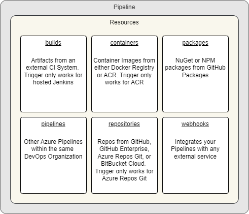
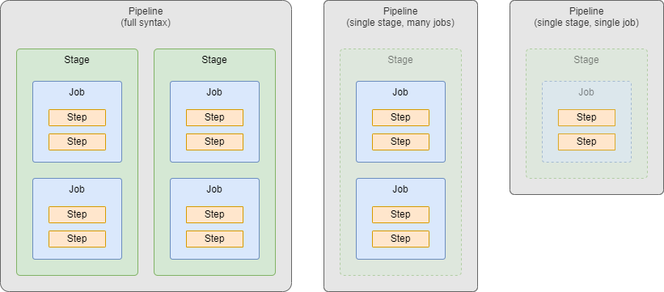

# Azure DevOps YAML Pipelines Guide

- Version: 1.1.2
- Author:
  - Nathan Nellans
  - Email: me@nathannellans.com
  - Web:
    - https://www.nathannellans.com
    - https://github.com/nnellans/ado-pipelines-guide

> [!WARNING]
> This is an advanced guide and assumes you already know the basics of Azure DevOps Pipelines. Think of this more like an advanced cheat sheet. I went through various sources, captured any notes that I felt were important, and organized them into the README file you see here. If you are new to ADO Pipelines, then I would suggest going through the Microsoft Docs or doing a couple Microsoft Learn courses first.

> [!IMPORTANT]
> This is a live document. Some of the sections are still a work in progress. I will be continually updating it over time.

> [!NOTE]
> Azure DevOps has two different types of Pipelines.  First, there are the "*Classic UI*" Pipelines, these come in both Build and Release forms.  Second, there are the YAML Pipelines that are defined strictly in code.  This guide will only focus on the modern YAML Pipelines.  Microsoft has even [started to](https://learn.microsoft.com/en-us/azure/devops/release-notes/2023/sprint-225-update#disable-creation-of-classic-pipelines-for-new-organizations-pre-announcement) disable Classic Pipelines for new Organizations.

---

# Table of Contents

**Part 1 - Pipeline-level information**:
- [name](#name)
- [appendCommitMessageToRunTime](#appendcommitmessagetorunname)
- [trigger](#trigger-aka-ci-trigger)
- [pr](#pr-aka-pr-trigger)
- [schedules](#schedules-aka-scheduled-trigger)
- [parameters](#parameters-aka-runtime-parameters)
- [variables](#variables)
- [pool](#pool)
- [resources](#resources)
  - [builds](#resources-builds)
  - [containers](#resources-containers)
  - [packages](#resources-packages)
  - [pipelines](#resources-pipelines)
  - [repositories](#resources-repositories)
  - [webhooks](#resources-webhooks)
- [lockBehavior](#lockbehavior)

**Part 2 - Defining the work done by the Pipeline**:
- [stages](#stages)
- [jobs](#jobs)
- [steps](#steps)

---

# Part 1 - Pipeline-level Information

## name
```yaml
name: string # the name to use for each 'run' of the pipeline. see more below
```
- Not to be confused with the actual name of the pipeline itself (which is defined in the Azure DevOps UI)
- This field is optional.  The default name of each run will be in this format: `yyyymmdd.xx` where:
  - `yyyymmdd` is the current date
  - `xx` is an iterator, which starts at `1` and increments with each run of the pipeline
- Expressions are allowed in the value in order to make the run name unique

## appendCommitMessageToRunName
```yaml
appendCommitMessageToRunName: boolean # is the latest Git commit message appended to the end of the run name? optional, default is true
```

## trigger (aka CI Trigger)
- Looks for pushes to branches and/or tags on the repo where the pipeline is stored
- This field is optional.  By default, a push to any branch of the repo will cause the pipeline to be triggered
- You cannot use variables in `trigger`, as variables are evaluated after triggers are evaluated
- `trigger` is not supported inside template files

There are 3 ways to define `trigger`:
```yaml
# Option 1 - Disable CI Triggers
trigger: 'none'

# Option 2 - Simplified Branch Syntax
trigger: # any push to any of these branches will trigger a pipeline run
- main
- feature/*

# Option 3 - Full Syntax
trigger:
  batch: boolean # see more below. optional, default is false
  branches:
    include:
    - main
    exclude:
    - feature/*
    - release/*
  paths: # see more below. optional, default is root of the repo
    include:
    - docs/readme.md
    - docs/app*
    exclude:
    - .gitignore
    - docs
  tags:
    include:
    - v2.*
    exclude:
    - v3.0
```
- `batch`: Setting this to true means only one instance of the pipeline will run at a time.  While the second run of the pipeline is waiting for its turn, it will batch up all of the changes that have been made while waiting, and when its finally able to run it will apply all of those changes at once
- If you specify both `branches` and `tags` then both will be evaluated.  If at least one of them matches, then the pipeline will be triggered
- `paths`: Cannot be used by itself, it can only be used in combination with `branches`
  - Paths in Git are case-sensitive

## pr (aka PR Trigger)
- Looks for Pull Requests that are opened on the repo where the pipeline is stored
- This field is optional.  By default, a PR opened on any branch of the repo will cause the pipeline to be triggered
- YAML PR triggers are only supported for GitHub and BitBucket Cloud
- You cannot use variables in `pr`, as variables are evaluated after triggers are evaluated
- `pr` is not supported inside template files

There are 3 ways to define `pr`:
```yaml
# Option 1 - Disable PR Triggers
pr: 'none'

# Option 2 - Simplified Branch Syntax
pr: # any Pull Request on any of these branches will trigger a pipeline run
- main
- feature/*

# Option 3 - Full Syntax
pr:
  autoCancel: boolean # if more updates are made to the same PR, should in-progress validation runs be canceled? optional, default is true
  drafts: boolean # will 'draft' PRs cause the trigger to fire? optional, default is true
  branches:
    include:
    - main
    exclude:
    - feature/*
    - release/*
  paths: # see more below. optional, default is root of the repo
    include:
    - docs/readme.md
    - docs/app*
    exclude:
    - .gitignore
    - docs
```
- `paths`: Cannot be used by itself, it can only be used in combination with `branches`
  - Paths in Git are case-sensitive

## schedules (aka Scheduled Trigger)
- `schedules` is optional, by default no scheduled runs will occur
- Schedules can be defined in two places: the Azure DevOps UI and in your pipeline's YAML.  If schedules are defined in both places, then only schedules in Azure DevOps UI will run<br />
- You cannot use variables in `schedules`, as variables are evaluated after triggers are evaluated
- `schedules` are not supported inside template files

Syntax
```yaml
schedules:
- cron: string # defines the cron syntax of this schedule in UTC time. must be the first property
  displayName: string
  batch: boolean # run a scheduled pipeline, even if the previously scheduled run is still in progress? optional, default is false
  always: boolean # run a scheduled pipeline, even if there were no source code changes since the last scheduled run? optional, default is false
  branches:
    include:
    - main
    exclude:
    - feature/*
    - release/*
```

## parameters (aka Runtime Parameters)
- `parameters` are optional, and if omitted, your pipeline simply won't use any Runtime Parameters

Defining `parameters`
```yaml
parameters:
- name: string # the symbolic name used to reference this parameter throughout your pipeline. required, must be the first property
  displayName: string # the human-readable name shown in the Azure DevOps UI. optional, default is same as name
  type: string # see more below. required
  default: 'someValue'
  values:
  - 'first allowed value'
  - 'second allowed value'
```
- Parameters must have a `type`, the accepted values are:
  - `boolean`, `number`, `object`, `string`
  - `environment`, `filePath`, `pool`, `secureFile`, `serviceConnection`
  - `container`, `containerList`, `deployment`, `deploymentList`, `job`, `jobList`, `stage`, `stageList`, `step`, `stepList`
- A parameter cannot be optional.  This means you must provide a value when running the pipeline manually, or the parameter must be configured with a `default` value. If neither of those are supplied, then the first value from the allowed `values` list will be used

Using Parameters
```yaml
# Option 1 - Template Expression
# processed once at compile time
# if the parameter doesn't exist, then it resolves to an empty string
# can be used in both YAML keys (left side) and YAML values (right side)
${{ parameters.varName }}    # index syntax
${{ parameters['varName'] }} # property deference syntax
```

## variables
`variables` are optional, and if omitted, your pipeline simply won't have any pipeline-level variables (they could still be defined at other levels though)

General info:
- Variable names must contain only letters, numbers, periods, or underscores
- Variable names must not begin with these words (regardless of capitalization): `endpoint`, `input`, `path`, `secret`, `securefile`
- Variables don't have a type, all variables are stored as strings
- Variables are mutable, the value can change from run to run, or from job to job (but you can override this with the `readonly` option)
- Azure DevOps uses many default system variables, and they all have predefined, read-only values. [More info here](https://learn.microsoft.com/en-us/azure/devops/pipelines/build/variables?view=azure-devops&tabs=yaml)

Variables can be defined at multiple places throughout your pipeline:<br />

  - When you define a variable with the same name in multiple places, the most specific place wins
  - The places, in order from least specific to most specific:
    - Azure DevOps UI
    - YAML pipeline-level (what we're discussing here)
    - YAML stage-level
    - YAML job-level

Both User-defined variables and System variables are automatically converted to environment variables inside the pipeline Agent:
- You must use your OS-specific syntax:
  - Mac and Linux: `$NAME`
  - Windows Batch: `%NAME%`
  - Windows PowerShell: `$env:NAME`
- When pipeline variables are converted to environment variables:
  - Variable names are converted to all uppercase
  - Any periods in the name are converted to underscores

There are 2 ways to define `variables`:
```yaml
# Option 1 - Mapping Syntax
# Does not support Variable Groups, Variable Templates, or setting a variable to read-only
variables:
  varName1: 'value1'
  varName2: 'value2'
  varName3: 'value3'

# Option 2 - List Syntax (full syntax)
variables:
- name: 'varName1'
  value: 'value1'
  readonly: boolean # optional, default is false
# specify a variable group
- group: 'varGroupName'
# specify a variable template
- template: path/to/template/file # must be the first property
  parameters: # optional parameters to pass into the template
    key: value
    key: value
```

Using Variables
```yaml
# Option 1 - Template Expression
# processed once at compile time
# if the variable doesn't exist, then it resolves to an empty string
# can be used in both YAML keys (left side) and YAML values (right side)
${{ variables.varName }}    # index syntax
${{ variables['varName'] }} # property deference syntax

# Option 2 - Macro Syntax
# processed at runtime, right before a task runs
# if the variable doesn't exist, then it is not changed and it will still say $(varName)
# only expanded when found in certain places, including: stages, jobs, steps, and some others
# can be used in YAML values (right side), but not in YAML keys (left side)
$(varName)

# Option 3 - Runtime Expression
# processed at runtime
# if the variable doesn't exist, then it resolves to an empty string
# can be used in YAML values (right side), but not in YAML keys (left side)
# must take up the entire right side of the YAML value
# meant to be used for conditions and expressions
$[ variables.varName ]    # index syntax
$[ variables['varName'] ] # property deference syntax
```

## pool
- This lets you specify the type of Agent that will be used to run all Jobs within your pipeline
- `pool` is optional, and if omitted, your YAML pipeline will default to using the Microsoft-hosted `ubuntu-latest`
- `pool` can be defined at multiple places throughout your pipeline:<br />
  - The most specific place wins
  - The places, in order from least specific to most specific:
    - YAML pipeline-level (what we're discussing here)
    - YAML stage-level
    - YAML job-level

There are 4 ways to define `pool`:
```yaml
# Option 1 - Use a self-hosted pool with no demands
pool: 'privatePoolName'

# Option 2 - Use a self-hosted pool with a single demand
pool:
  name: 'privatePoolName'
  demands: 'singleDemand'

# Option 3 - Use a self-hosted pool with multiple demands
pool:
  name: 'privatePoolName'
  demands:
  - 'firstDemand'
  - 'secondDemand'

# Option 4 - Use a Microsoft-hosted pool
pool:
  vmImage: 'ubuntu-latest'
```
- [List](https://learn.microsoft.com/en-us/azure/devops/pipelines/agents/hosted) of Microsoft-hosted agents

## resources
You can define builds, containers, packages, pipelines, repositories, and webhooks.  Each one of these resources can be consumed by your Pipeline, or used to trigger your Pipeline<br />

### <ins>Resources: builds</ins>
These are artifacts produced by an external CI system

```yaml
resources:
  builds:
  - build: string # the symbolic name used to reference this artifact. required, must be the first property. accepts only letters, numbers, dashes, and underscores
    type: string # specifies the type of artifact. required. examples: Jenkins, circleCI
    connection: string # the Azure DevOps Service Connection used to communicate with the external CI system. required
    source: string # depends on the external CI system (for Jenkins this would be the Project name). required
    version: string # the build number from the external CI system. optional, default is latest successful build
    branch: string
    trigger: boolean # when this artifact is updated, is it allowed to trigger this pipeline? optional, default is none. accepts only none or true
```
- `trigger` is only supported for hosted Jenkins, where Azure DevOps has line of sight with Jenkins server
- Build resources are not automatically downloaded by Jobs.  To consume Builds use a [downloadBuild](https://learn.microsoft.com/en-us/azure/devops/pipelines/yaml-schema/steps-download-build) Step / [DownloadBuildArtifacts](https://learn.microsoft.com/en-us/azure/devops/pipelines/tasks/reference/download-build-artifacts-v1) Task

### <ins>Resources: containers</ins>
These are container images

```yaml
# define a container from Docker Registry
resources:
  containers:
  - container: string # the symbolic name used to reference this image. required, must be the first property. accepts only letters, numbers, dashes, and underscores
    image: string # required. examples: ubuntu:16.04, company.azurecr.io/repo:1.0.0
    endpoint: string # the Docker Service Connection used to communicate with the private registry
    env: # variables to map into the container's environment
      string: string
    mapDockerSocket: boolean # map the /var/run/docker.sock volume on container jobs? optional, default is true
    options: string # arguments to pass to the container at startup
    ports: # expose ports on the Container
    - '8080:80' # binds port 80 on the Container to port 8080 on the host Agent
    - '6380' # binds port 6380 on the Container to a random available port on the host Agent
    volumes: # mount volumes on the Container
    - '/src/dir1:/dst/dir2' # mount /src/dir1 from the host Agent to /dst/dir2 on the Container
    mountReadOnly: # which volumes should be mounted as read-only? optional, all 4 have default of false
      work: boolean # mount the work directory as readonly?
      externals: boolean # mount the externals directoy as readonly? these are components required to talk with the Agent
      tools: boolean # mount the tools directory as readonly? these are installable tools like Python and Ruby
      tasks: boolean # mount the tasks directory as readonly? these are tasks required by the job

# define a container from Azure Container Registry
resources:
  containers:
  - container: string # the symbolic name used to reference this image. required, must be the first property. accepts only letters, numbers, dashes, and underscores
    type: 'ACR'
    azureSubscription: string # the AzureRM Service Connection used to communicate with ACR
    resourceGroup: string # the Resource Group where the ACR is located
    registry: string # name of the registry in ACR
    repository: string # name of the repo in ACR
    env: # variables to map into the container's environment
      string: string
    mapDockerSocket: boolean # map the /var/run/docker.sock volume on container jobs? optional, default is true
    options: string # arguments to pass to the container at startup
    ports: # expose ports on the Container
    - '8080:80' # binds port 80 on the Container to port 8080 on the host Agent
    - '6380' # binds port 6380 on the Container to a random available port on the host Agent
    volumes: # mount volumes on the Container
    - '/src/dir1:/dst/dir2' # mount /src/dir1 from the host Agent to /dst/dir2 on the Container
    mountReadOnly: # which volumes should be mounted as read-only? optional, all 4 have default of false
      work: boolean # mount the work directory as readonly?
      externals: boolean # mount the externals directoy as readonly? these are components required to talk with the Agent
      tools: boolean # mount the tools directory as readonly? these are installable tools like Python and Ruby
      tasks: boolean # mount the tasks directory as readonly? these are tasks required by the job
    trigger: # if the container image is updated, will it trigger this pipeline? see more below. optional, default is none
```
- To consume a Container resource, use a Container Job, a Step Target, or a Service Container
- Container `trigger` is ONLY supported for ACR
- `trigger` options in depth:
  ```yaml
  # option 1 - Disable
  trigger: 'none'

  # option 2 - Trigger on all image tags (shortcut syntax)
  trigger: 'true'

  # option 3 - Trigger on all image tags (full syntax)
  trigger:
    enabled: 'true'

  # option 4 - Trigger on specific image tags
  trigger:
    enabled: 'true'
    tags:
      include:
      - 'ubuntu:16.04'
      exclude:
      - 'ubuntu:18.04'
  ```

### <ins>Resources: packages</ins>
These are nuget or npm packages stored on GitHub Packages

```yaml
resources:
  packages:
  - package: string # the symbolic name used to reference this package. required, must be the first property. accepts only letters, numbers, dashes, and underscores
    type: string # the type of the package. required. examples: nuget, npm
    connection: string # the Azure DevOps Service Connection used to communicate with GitHub. required
    name: string # the repo and name of the package. required. example: someRepo/somePackage
    version: string # the version of the package. optional, default is the latest version
    tag: string
    trigger: string # if the package is updated, will it trigger this pipeline? optional, default is none. accepts only none or true
```
- Package resources are not automatically downloaded by Jobs.  To consume Packages use a [getPackage](https://learn.microsoft.com/en-us/azure/devops/pipelines/yaml-schema/steps-get-package) Step / [DownloadPackage](https://learn.microsoft.com/en-us/azure/devops/pipelines/tasks/reference/download-package-v1) Task

### <ins>Resources: pipelines</ins>
These are other Azure DevOps YAML Pipelines

```yaml
resources:
  pipelines:
  - pipeline: string # the symbolic name used to reference this other pipeline. required, must be the first property. accepts only letters, numbers, dashes, and underscores
    project: string # the azure devops project where this other pipeline is located. optional, default is the current azure devops project
    source: string # the name of this other pipeline
    trigger: # if the referenced pipeline is ran successfully, will it trigger the parent pipeline? see more below. optional, default is none
    # the next 3 options are used as defaults for manual or scheduled triggers of the parent pipeline
    version: string # the run name from this other pipeline. optional, default is the latest successful run across all stages
    branch: string # branch to pick the artifact. optional, defaults to all branches
    tags: # List of tags required on the other pipeline. optional
    - string
```
- Pipeline artifacts are not automatically downloaded by Traditional Jobs.  To consume Pipeline resources in Traditional Jobs use a [Download](https://learn.microsoft.com/en-us/azure/devops/pipelines/yaml-schema/steps-download) Step / [DownloadPipelineArtifact](https://learn.microsoft.com/en-us/azure/devops/pipelines/tasks/reference/download-pipeline-artifact-v2) Task
- Pipeline artifacts are automatically downloaded by Deployment Jobs, but only in the `deploy` lifecycle hook.  To disable this, you can insert a `download: none` Step
- When an update to the Pipeline `resource` causes the parent Pipeline to trigger:
  - If the Pipeline `resource` and the parent Pipeline are from the same repository, and the Pipeline `resource` triggers because of an update to Branch A, then the parent Pipeline will be run using that same Branch A.
  - If the Pipeline `resource` and the parent Pipeline are from different repositories, then the parent Pipeline will always run using its own default Branch, it doesn't matter which branch the Pipeline `resource` was updated on
- `trigger` options in depth:
  ```yaml
  # option 1 - Disable
  trigger: 'none'

  # option 2 - Trigger on a successful run from all branches
  trigger: 'true'

  # option 3 - Trigger on a successful run from a specific list of branches (simplified syntax)
  trigger:
    enabled: boolean # optional, default is true
    branches:
    - 'main'
    - 'feature/*'

  # option 4 - Full Syntax
  trigger:
    enabled: boolean # optional, default is true
    branches: # trigger on a successful run from a specific list of branches
      include:
      - 'main'
      exclude:
      - 'feature/*'
    tags: # list of tags that when matched will trigger the pipeline
    - 'three'
    stages: # list of Pipeline Stages that must be completed successfully
    - 'four'
  ```
  - `tags` are AND'ed, meaning all of the tags listed must be present
  - `stages` are AND'ed, meaning all of the stages listed must be successfully completed
  - If branches, tags, and stages are all defined, then all of them must be fully satisfied for the trigger to fire

### <ins>Resources: repositories</ins>
These are source code repositories

```yaml
resources:
  repositories:
  - repository: string  # the symbolic name used to reference this repo. required, must be the first property. accepts only letters, numbers, dashes, and underscores
    type: string  # the type of repo. accepts only git, github, githubenterprise, and bitbucket
    name: string  # the repository name, what you put here depends on the value of type. see more below
    ref: string  # the ref to checkout (branch, tag, etc.). optional, default is refs/heads/main
    endpoint: string  # the Azure DevOps Service Connection used to communicate with the repo
    trigger:  # if the repository is updated, will it trigger this pipeline? supported only for Azure Repos Git. see more below. optional, the default is none
```
- Repository resources are not automatically downloaded by the pipeline.  So, in order for your Job to use them, you must first include a [checkout](https://learn.microsoft.com/en-us/azure/devops/pipelines/yaml-schema/steps-checkout?view=azure-pipelines) Step in your Job
- For Azure Repos Git use `type: git`
- What you pick for `type` dictates what you should put for `name`
  - For `type: git` (Azure Repos Git)
    - If the repo exists in the same DevOps Project, then set `name: someRepo`
    - If the repo exists in a different DevOps Project, then set `name: someProject/someRepo`
  - For any other allowed `type`
    - Set `name: orgName/someRepo` or `name: userName/someRepo`
- Repository `trigger` is ONLY supported for Azure Repos Git
- `trigger` options in depth:
  ```yaml
  # option 1 - Disable
  trigger: 'none'

  # option 2 - Simplified Branch Syntax
  trigger:
  - 'main'
  - 'release/*'

  # option 3 - Full Syntax
  trigger:
    branches:
      include:
      - 'main'
      exclude:
      - 'feature/*'
    paths: # see more below. optional, default is root of the repo
      include:
      - '/src'
      exclude:
      - '/src/dir1'
    tags:
      include:
      - 'v1'
      exclude:
      - 'v2'
  ```
  - If you specify both `branches` and `tags` then both will be evaluated.  If at least one of them matches, then the pipeline will be triggered
  - `paths`: Cannot be used by itself, it can only be used in combination with `branches`
    - Paths in Git are case-sensitive

### <ins>Resources: webhooks</ins>
These are external services that can be used to trigger your Pipeline

```yaml
resources:
  webhooks:
  - webhook: string # the symbolic name used to reference this repo. required, must be the first property. accepts only letters, numbers, dashes, and underscores
    connection: string # the name of the Azure DevOps Service Connection tied to this Webhook. required
    type: string # the name of the webhook extension, leave this empty if this is an offline webhook
    filters: # list of filters for this trigger
    - path: string # the json path to select data from the event payload
      value: string # the expected value for the filter to match
```
- `filters` are AND'ed, meaning all of the filters listed must be matched
- To consume the webhook's JSON payload in your Pipeline, you can use a parameter with the format <br />`${{ parameters.webhookSymbolicName.jsonPath }}`
- When creating the Webhook in the external service, make sure to point it at <br />`https://dev.azure.com/yourOrgName/_apis/public/distributedtask/webhooks/yourWebhookSymbolicName?api-version=6.0-preview`

## lockBehavior
This is a 2 step process.

First, you must define an Exclusive Lock on a supported resource. The types of resources that support Exclusive Locks are:
- Agent Pools
  - Project Settings > Agent pools > your-Pool > Approvals and checks > Add check > Exclusive Lock
- Repositories
  - Project Settings > Repositories > your-Repo > Approvals and checks > Add check > Exclusive Lock
- Service Connections
  - Project Settings > Service connections > your-Connection > Approvals and checks > Add check > Exclusive Lock
- Secret Variables in Variable Groups
  - Pipelines > Library > Variable groups > your-Group > Approvals and checks > Add check > Exclusive Lock
  - This is only for variables marked as secret, as access to nonsecret variables isn't limited by checks.
- Secure Files
  - Pipelines > Library > Secure files > your-File > Approvals and checks > Add check > Exclusive Lock
- Environments
  - Pipelines > Environments > your-Environment > Approvals and checks > Add check > Exclusive Lock
- Stages
  - If you have a Stage with an ID and specify its `lockBehavior` property, a lock is automatically created for that Stage

Second, you must define settings for `lockBehavior`:

If a Protected Resource is configured with an exclusive lock check, then only one run of the Pipeline can access that Protected Resource at a time.  While that one run of the Pipeline is executing there may be more runs of the Pipeline that are queued up and waiting to go.  What happens with these queued Pipelines depends on the value of the `lockBehavior` parameter.

```yaml
lockBehavior: string # optional, default value is runLatest. accepts only sequential or runLatest
```
- `runLatest` all runs of the Pipeline that are waiting are cancelled, except for the latest run
  - An exemption is when you create an Exclusive Lock on a Stage.  In this case, only runs of the Pipeline on the same branch will be cancelled
- `sequential` all runs of the Pipeline are allowed to execute one-by-one when it is their turn

lockBehavior can be defined at multiple places in your pipeline:<br />

---

# Part 2 - Defining the work done by the Pipeline
A Pipeline contains one or more Stages.  Each Stage contains one or more Jobs.  Each Job contains one or more Steps.  There are shortcut syntaxes available if you have just one Stage, or if you have a single Stage and a single Job.<br />

## stages
- Max of 256 Jobs per Stage
- Stages run sequentially in the order they are defined in the YAML, by default
  - This is because each Stage has a hidden, implicit dependency on the previous Stage
  - If you don't want your Stages running sequentially, then you can use `dependsOn` in each Stage to create your own order of operations
  - By adding `dependsOn: []` to a Stage you remove any dependencies altogether, allowing that Stage to run in parallel with others
- Stages will not run if the previous Stage fails, by default
  - Each Stage has a hidden, implicit condition that the previous Stage must complete successfully
  - By adding a `condition` to a Stage you could force a Stage to run, even if the previous Stage fails
  - Adding a `condition` to a Stage will remove the implicit condition that says the previous Stage must succeed.  Therefore, it is common to use a condition of `and(succeeded(),yourCustomCondition)` which adds the implicit success condition back, as well as adds your own custom condition.  Otherwise, this Stage will run regardless of the outcome of the preceding Stage
- Adding `trigger: manual` to a Stage will make it so a manual approval of that Stage is required
  - Manually triggered Stages have no dependencies
  - Manually triggered Stages can be run at any time
  - A pipeline run will complete when there are only manually triggered Stages left to execute

```yaml
# defining a Stage
stages:
- stage: string # the symoblic name used to reference this stage. must be the first property
  displayName: string # human-readable name for the stage. optional
  trigger: manual # specify this to require manual approval of this stage. optional
  pool: pool # specify the stage-level pool where jobs in this stage will run. optional
  dependsOn: # first form. any stages which must complete before this one. optional
  - stageName1
  - stageName2
  dependsOn: stageName # second form. a stage which must complete before this one. optional
  isSkippable: boolean # to prevent skipping this stage, set to false. optional, default is true
  condition: string # evaluate this expression to determine whether to run this stage
  variables: variables # specify any stage-level variables. optional
  lockBehavior: string # optional, default value is runLatest. accepts only sequential or runLatest
  templateContext:  # additional Stage-related info you can pass into an extended template
  jobs:
  - job: # traditional job
  - deployment: # deployment job
  - template: # job template

# defining a Stage template
stages:
- template: path/to/template/file # must be the first property
  parameters: # optional parameters to pass into the template
    key: value
    key: value
```

## jobs
- Each Job is run by a single Agent, and each Agent can only run one Job at a time
- Jobs run in parallel, by default. However, to run multiple Jobs in parallel you must have:
  - One, a sufficient amount of available Agents
  - Two, a sufficient amount of Parallel Job licenses
  - If you don't want your Jobs running in parallel, then you can use `dependsOn` in each Job to create your own order of operations
- Setting `timeoutInMinutes` to 0 means setting it to the maximum, which can be:
  - Forever on self-hosted Agents
  - 360 minutes on Microsoft-hosted Agents for a public project and public repo
  - 60 minutes on Microsoft-hosted Agents for a private project and private repo
- There are a handful of supported [Agentless Jobs](https://learn.microsoft.com/en-us/azure/devops/pipelines/process/phases?#agentless-tasks)
- Jobs come in 2 different forms:
  - Traditional Jobs:
    - Support the optional `matrix` and `parallel` strategies
    - Have a hidden Step for `checkout: self`. This behavior can be disabled by specifying a Step for `checkout: none`
    - Do NOT have a hidden Step for `download`, so you must specify this Step if needed
  - Deployment Jobs:
    - Deploy to an Azure DevOps `environment`
    - Provide a deployment history
    - Support the `runOnce`, `rolling`, and `canary` strategies
    - Do NOT have a hidden Step for `checkout: self`, so you must specify this Step if needed
    - Have a hidden Step for `download` (inside the `deploy` lifecycle hook only?). This behavior can be disabled by specifying a Step for `download: none`
  - Both types of Jobs can exist in the same Stage

```yaml
# defining a Traditional Job
stages:
- stage: string
  jobs:
  - job: string # the symbolic name used to reference this job. must be the first property. accepts only letters, numbers, dashes, and underscores
    displayName: string # human-readable name for the job. optional
    pool: pool # specify the pool where this job will run. optional
    dependsOn: # first form. any jobs which must complete before this one. optional
    - jobName1
    - jobName2
    dependsOn: jobName # second form. a job which must complete before this one. optional
    condition: string # evaluate this condition expression to determine whether to run this job. optional
    continueOnError: boolean # setting this to true means future jobs should run even if this job fails. optional, default is false
    timeoutInMinutes: number # how long to run the job before automatically cancelling. optional, default is 60
    cancelTimeoutInMinutes: number # how much time to give 'run always even if cancelled tasks' before killing them
    variables: variables # specify any job-level variables. optional
    workspace:
      clean: string # what to clean up before the job runs. accepts only outputs, resources, or all
    container: containerReference # container to run this job inside
    services: containerReference # service container(s) to use
    uses: # any resources (repos or pools) required by this job that are not already referenced
      repositories: # Repository references to Azure Git repositories
      pools: # Pool names, typically when using a matrix strategy for the job
    templateContext:  # additional Job-related info you can pass into an extended template
    # option 1 - parallel strategy (aka slicing): duplicate a job and run the copies in parallel. the tasks in the should understand they are being run in parallel
    strategy: # optional
      parallel: number # run the job this many times
    # option 2 - matrix strategy: run the same job multiple times in parallel using different variable sets
    strategy: # optional
      matrix:
        firstConfig: # accepts only letters, numbers, and underscores. must start with a letter
          key: value
          key: value
        secondConfig:
          key: value
          key: value
      maxParallel: number # maximum number of matrix jobs that can run in parallel. default is 0 (meaning no limit)
    steps:
    - task: # standard task
    - shortcut: # task shortcut, examples: pwsh, script, publish, etc.
    - template: # step template

# defining a Deployment Job (runOnce strategy)
stages:
- stage: string
  jobs:
  - deployment: string # the symbolic name used to reference this job. must be the first property
    displayName: string  # human-readable name for the job. optional
    pool: pool  # specify the pool where this job will run. optional
    dependsOn: # first form. any jobs which must complete before this one. optional
    - jobName1
    - jobName2
    dependsOn: jobName # second form. a job which must complete before this one. optional
    condition: string  # evaluate this condition expression to determine whether to run this job. optional
    continueOnError: string  # setting this to true means future jobs should run even if this job fails. optional, default is false
    timeoutInMinutes: string  # how long to run the job before automatically cancelling. optional, default is 60
    cancelTimeoutInMinutes: string  # how much time to give 'run always even if cancelled tasks' before killing them
    variables: variables  # specify any job-level variables. optional
    workspace:
      clean: string # what to clean up before the job runs. accepts only outputs, resources, or all
    container: containerReference # container to run this job inside
    services: containerReference # service container(s) to use
    uses: # Any resources (repos or pools) required by this job that are not already referenced
      repositories: [ string ] # Repository references to Azure Git repositories
      pools: [ string ] # Pool names, typically when using a matrix strategy for the job
    templateContext:  # additional Deployment-related info you can pass into an extended template
    environment: deploymentEnvironment  # environment name to run the job against, and optionally a specific resource in the environment. example: environment-name.resource-name
    environment: # full syntax
      name: string # name of environment
      resourceName: string # name of resource
      resourceId: string # id of resource
      resourceType: string # type of environment resource
      tags: string # list of tag filters
    strategy: # execution strategy for this deployment. Options: runOnce, rolling, canary
      runOnce:
        preDeploy: # steps that initialize resources before application deployment starts. executed once
          pool:
          steps:
        deploy: # steps that deploy your application. executed once
          pool:
          steps:
        routeTraffic: # steps that serve the traffic to the updated version. executed once
          pool:
          steps:
        postRouteTraffic: # steps after the traffic is routed, typically, these tasks monitor the health of the updated version for defined interval. executed once
          pool:
          steps:
        on:
          failure: # runs on failure of any step
            pool:
            steps:
          success: # runs on success of all steps
            pool:
            steps:

# defining a Deployment Job (rolling strategy)
# this only works for environments using Virtual Machines
stages:
- stage: string
  jobs:
  - deployment: string # the symbolic name used to reference this job. must be the first property
    environment: string
    strategy:
      rolling:
        maxParallel: 5 # how many VMs will be updated at a time. can be specified in exact numbers (5) or percentages (10%)
        preDeploy: # executed once per batch size
        deploy: # executed once per batch size
        routeTraffic: # executed once per batch size
        postRouteTraffic: # executed once per batch size
        on:
          failure:
          success:

# defining a Deployment Job (canary strategy)
# the increments parameters specifies how many resources to update per iteration
stages:
- stage: string
  jobs:
  - deployment: string # the symbolic name used to reference this job. must be the first property
    environment: string
    strategy:
      canary:
        increments: [10,20] # deploy to 10% and verify success, then deploy to 20% and verify success, if everything is good then deploy again to 100%
        preDeploy: # executed once
        deploy: # executed with each iteration
        routeTraffic: # executed with each iteration
        postRouteTraffic: # executed with each iteration
        on:
          failure:
          success:

# defining a Job template
stages:
- stage: string
  jobs:
  - template: path/to/template/file # must be the first property
    parameters: # optional parameters to pass into the template
      key: value
      key: value
```

## steps
- Steps run sequentially, and there is no way to change this
- Steps are used to run Tasks:
  - There are many [built-in Tasks](https://github.com/microsoft/azure-pipelines-tasks/tree/master/Tasks)
  - There are also many Tasks you can install from the [Visual Studio Marketplace](https://marketplace.visualstudio.com/azuredevops)
  - You can also write and use your own custom Tasks
- There are a handful of Tasks that can also be referenced by shortcut syntaxes, such as:
  - `script` is a shortcut for the CmdLine Task
  - `powershell` is a shortcut for the PowerShell Task (with the option `pwsh: false`)
  - `pwsh` is a shortcut for the PowerShell Task (with the option `pwsh: true`)
  - `bash` is a shortcut for the ShellScript Task
  - `download` is a shortcut for the DownloadPipelineArtifact Task
  - `downloadBuild` is a shortcut for the DownloadBuildArtifacts Task
  - `getPackage` is a shortcut for the DownloadPackage Task
  - `publish` is a shortcut for the PublishPipelineArtifact Task
  - `restoreCache` is a shortcut for the Cache Task
  - `saveCache` is a shortcut for the Cache Task
  - `reviewApp` is a shortcut for the ReviewApp Task
- One oddball is the `checkout` shortcut, which actually doesn't have a backend Task associated with it
- Each Step runs in its own process on the Agent that is running the Job, this means:
  - Variables are NOT preserved between Steps in the same Job
  - File System changes are preserved between Steps in the same Job

```yaml
# defining a Task
stages:
- stage: string
  jobs:
  - job: string
    steps:
    - task: string # task name and version, example: VSBuild@1. must be the first property
      inputs: # specific to the chosen task
        key: value
        key: value
      name: string # the symbolic name used to reference this step. accepts only letters, numbers, and underscores. optional
      displayName: string # human-readable name for this step. optional
      enabled: boolean # run this step? optional, default is true
      condition: string # evaluate this condition expression to determine whether to run this step. optional
      continueOnError: boolean # setting this to true means future steps should run even if this step fails. optional, default is false
      retryCountOnTaskFailure: number # max number of retries if the task fails. optional, default is 0
      timeoutInMinutes: string # time to wait for this task to complete before the server kills it. optional
      env:  # environment variables to map into the process's environment. optional
        KEY: value
        KEY: value
      target: # accepts either 'host' or the name of a container resource. optional

# defining a task shortcut
stages:
- stage: string
  jobs:
  - job: string
    steps:
    - shortcutName: string # specific to the chosen shortcut. example: pwsh. must be the first property
      key: value # specific to the chosen shortcut
      key: value # specific to the chosen shortcut
      name: string # the symbolic name used to reference this step. accepts only letters, numbers, and underscores. optional
      displayName: string # human-readable name for this step. optional
      enabled: boolean # run this step? optional, default is true
      condition: string # evaluate this condition expression to determine whether to run this step. optional
      continueOnError: boolean # setting this to true means future steps should run even if this step fails. optional, default is false
      retryCountOnTaskFailure: number # max number of retries if the task fails. optional, default is 0
      timeoutInMinutes: string # time to wait for this task to complete before the server kills it. optional
      env:  # environment variables to map into the process's environment. optional
        KEY: value
        KEY: value
      target: # accepts either 'host' or the name of a container resource. optional

# defining a step template
stages:
- stage: string
  jobs:
  - job: string
    steps:
    - template: path/to/template/file # must be the first property
      parameters: # optional parameters to pass into the template
        key: value
        key: value
```

---

# Part 3 - More topics to come
- Templates, Extends, TemplateContext
- Environments
- Container Jobs, Service Containers, Step Targets
- Pipeline Artifacts
