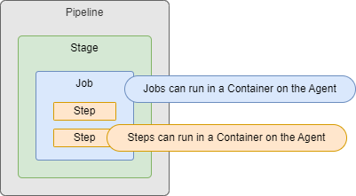

**Warning**: This is an advanced guide and assumes you already know the basics of Azure DevOps Pipelines. Think of this more like an advanced cheat sheet. I went through various sources, captured any notes that I felt were important, and organized them into the README file you see here. If you are new to ADO Pipelines, then I would suggest going through the Microsoft Docs or doing a couple Microsoft Learn courses first.

It's important to know that this is a live document. Some of the sections are still a work in progress. I will be continually updating it over time.

Azure DevOps has two different types of Pipelines.  First, there is the "*Classic UI*" Pipelines, these come in both Build and Release forms.  Second, there are the YAML Pipelines that are defined strictly in code.  This guide will only focus on the modern YAML Pipelines.

---

# High-Level Pipeline Structure

There are two main types of information defined in a YAML Pipeline:
- One, pipeline-level information. This includes things like triggers, parameters, variables, agent pools, repositories, etc.
- Two, the actual work being done by the Pipeline.  There are three different ways you can define the work:<br />
  - The standard way by defining `Stages`, `Jobs`, and `Steps`.  This way will always work, no matter how many Stages or Jobs you have.
  - If you have one Stage with multiple Jobs, then you can omit the `Stages` layer.  So, all you need to define is `Jobs` and `Steps`.
  - If you have one Stage with one Job, then you can omit both the `Stages` and `Jobs` layer.  So, all you need to define is `Steps`.

---

# Pipeline-level information

Let's start by going over the common fields that can be defined at the root of the Pipeline, they are:
- [name](#name)
- [appendCommitMessageToRunTime](#appendcommitmessagetorunname)
- [trigger](#trigger-aka-ci-trigger)
- [pr](#pr-aka-pr-trigger)
- [schedules](#schedules-aka-scheduled-trigger)
- [parameters](#parameters-aka-runtime-parameters)
- [variables](#variables)
- [pool](#pool)
- [resources](#resources)
  - [builds](#resources-builds)
  - [containers](#resources-containers)
  - [packages](#resources-packages)
  - [pipelines](#resources-pipelines)
  - [repositories](#resources-repositories)
  - webhooks
- lockBehavior

---

## name
```yaml
name: string # the name to use for each 'run' of the pipeline. optional, default is date.iterator (see below)
```
- Not to be confused with the actual name of the pipeline itself (which is defined in the Azure DevOps UI)
- This field is optional.  The default name of each run will be in this format: `yyyymmdd.xx` where:
  - `yyyymmdd` is the current date
  - `xx` is an iterator, which starts at `1` and increments with each run of the pipeline
- Expressions are allowed in the value

---

## appendCommitMessageToRunName
```yaml
appendCommitMessageToRunName: boolean # is the latest Git commit message appended to the end of the run name? optional, default is true
```

---

## trigger (aka CI Trigger)
- Specifies the Continuous Integration (CI) triggers that will be used to automatically start the pipeline
- This looks for pushes to branches and/or tags on the repo where the pipeline's YAML file is stored
- This field is optional.  By default, a push to any branch of the repo will cause the pipeline to be triggered
- You cannot use variables in `triggers`, as variables are not evaluated until after the pipeline triggers
- `triggers` are not supported inside template files

There are 3 ways to define `triggers`:
```yaml
# Option 1 - Disable CI Triggers
trigger: 'none' # pushes to branches will not trigger the pipeline

# Option 2 - Simplified Branch Syntax
trigger: # any push to any of these branches will trigger a pipeline run
- main
- feature/*

# Option 3 - Full Syntax
trigger:
  batch: boolean # more info below. optional, default is false
  branches:
    include:
    - main
    exclude:
    - feature/*
    - release/*
  paths: # more info below. optional, default is root of the repo
    include:
    - docs/readme.md
    - docs/app*
    exclude:
    - .gitignore
    - docs
  tags:
    include:
    - v2.*
    exclude:
    - v3.0
```
- `batch`: Setting this to true means only one instance of the pipeline will run at a time.  While the second run of the pipeline is waiting for its turn, it will batch up all of the changes that have been made while waiting, and when its finally able to run it will apply all of those changes at once
- If you specify both `branches` and `tags` then both will be evaluated.  If at least one of them matches, then the pipeline will be triggered
- `paths`: Cannot be used by itself, it can only be used in combination with `branches`
  - Paths in Git are case-sensitive

---

## pr (aka PR Trigger)
- Specifies the Pull Request (PR) triggers that will be used to automatically start the pipeline
- This looks for Pull Requests that are opened on the repo where the pipeline's YAML file is stored
- This field is optional.  By default, a PR opened on any branch of the repo will cause the pipeline to be triggered
- YAML PR triggers are only supported for GitHub and BitBucket Cloud
- You cannot use variables in `pr`, as variables are not evaluated until after the pipeline triggers
- `pr` is not supported inside template files

There are 3 ways to define `pr`:
```yaml
# Option 1 - Disable PR Triggers
pr: 'none' # Pull Requests on branches will not trigger a pipeline run

# Option 2 - Simplified Branch Syntax
pr: # any Pull Request on any of these branches will trigger a pipeline run
- main
- feature/*

# Option 3 - Full Syntax
pr:
  autoCancel: boolean # if more updates are made to the same PR, should in-progress validation runs be canceled? optional, default is true
  drafts: boolean # will 'draft' PRs cause the trigger to fire? optional, default is true
  branches:
    include:
    - main
    exclude:
    - feature/*
    - release/*
  paths: # more info below. optional, default is root of the repo
    include:
    - docs/readme.md
    - docs/app*
    exclude:
    - .gitignore
    - docs
```
- `paths`: Cannot be used by itself, it can only be used in combination with `branches`
  - Paths in Git are case-sensitive

---

## schedules (aka Scheduled Trigger)
- Scheduled triggers configure a pipeline to run on a schedule
- `schedules` is optional, by default no scheduled runs will occur
- Schedules can be defined in two places: the Azure DevOps UI and in your pipeline's YAML.  If schedules are defined in both places, the schedules in Azure DevOps UI will take precedence
- You cannot use variables in `schedules`
- `schedules` are not supported inside template files

Syntax
```yaml
schedules:
- cron: string # defines the cron syntax of this schedule in UTC time. must be the first property
  displayName: string
  batch: boolean # run a scheduled pipeline, even if the previously scheduled run is still in progress? optional, default is false
  always: boolean # run a scheduled pipeline, even if there were no source code changes since the last scheduled run? optional, default is false
  branches:
    include:
    - main
    exclude:
    - feature/*
    - release/*
```

---

## parameters (aka Runtime Parameters)
- `parameters` defined at the pipeline-level are also known as 'Runtime Parameters'
- When you manually run the pipeline from the Azure DevOps UI, you will be able to select/enter values for these parameters
- `parameters` are optional, and if omitted, your pipeline simply won't use any Runtime Parameters
- Parameters are expanded early in the processing of a pipeline run, so not all variables will be available to use within parameters. More [here](https://learn.microsoft.com/en-us/azure/devops/pipelines/build/variables)

Syntax
```yaml
parameters:
- name: string # the ID used to reference this parameter throughout your pipeline. required, must be the first property
  displayName: string # the human-readable name shown in the Azure DevOps UI. optional, default is same as name
  type: string # more info below. required
  default: 'someValue'
  values:
  - 'first allowed value'
  - 'second allowed value'
```
- `type` accepts any of the following:
  - `boolean`, `number`, `object`, `string`
  - `environment`, `filePath`, `pool`, `secureFile`, `serviceConnection`
  - `container`, `containerList`, `deployment`, `deploymentList`, `job`, `jobList`, `stage`, `stageList`, `step`, `stepList`
- A parameter cannot be optional.  This means you must provide a value when running the pipeline manually, or the parameter must be configured with a `default` value. If neither of those are supplied, then the first value from the allowed `values` list will be used

---

## variables
Here you can specify variables that can be referenced throughout your pipeline

`variables` are optional, and if omitted, your pipeline simply won't have any pipeline-level variables (they could still be defined at other levels though)

General info:
- Variable names must contain only letters, numbers, periods, or underscores
- Variable names must not begin with these words (regardless of capitalization): `endpoint`, `input`, `path`, `secret`, `securefile`
- Variables don't have a type, all variables are stored as strings
- Variables are mutable, the value can change from run to run, or from job to job (but you can override this with the `readonly` option)
- Azure DevOps uses many default system variables, and they all have predefined values that are read-only. More [here](https://learn.microsoft.com/en-us/azure/devops/pipelines/build/variables?view=azure-devops&tabs=yaml)

Variables can be defined at multiple places throughout your pipeline:
  - When you define a variable with the same name in multiple places, the most specific place wins
  - The places, in order from least specific to most specific:
    - Azure DevOps UI
    - YAML pipeline-level (what we're discussing here)
    - YAML stage-level
    - YAML job-level

Both User-defined variables and System variables are automatically converted to environment variables inside the pipeline Agent:
- OS-specific environment variable naming standards:
  - Mac and Linux: `$NAME`
  - Windows Batch: `%NAME%`
  - Windows PowerShell: `$env:NAME`
- When pipeline variables are converted to environment variables:
  - Variable names are converted to uppercase
  - Any periods in the name are converted to underscores

There are 2 ways to define `variables`.  You must pick only one, as you can't mix both styles:
```yaml
# Option 1 - Mapping Syntax
# Does not support Variable Groups, Variable Templates, or setting a variable to read-only
variables:
  varName1: 'value1'
  varName2: 'value2'
  varName3: 'value3'

# Option 2 - List Syntax (full syntax)
variables:
- name: 'varName1'
  value: 'value1'
  readonly: boolean # optional, default is false
# specify a variable group
- group: 'varGroupName'
# specify a variable template
- template: 'templateFile'
  parameters:
    param1: 'value1'
    param2: 'value2'
```

---

## pool
- This lets you specify the type of Agent that will be used to run all Jobs within your pipeline
- `pool` is optional, and if omitted, your YAML pipeline will default to using the Microsoft-hosted `ubuntu-latest`
- `pool` can be defined at multiple places throughout your pipeline:
  - The most specific place wins
  - The places, in order from least specific to most specific:
    - YAML pipeline-level (what we're discussing here)
    - YAML stage-level
    - YAML job-level

There are 4 ways to define `pool`:
```yaml
# Option 1 - Use self-hosted agents with no demands
pool: 'privatePoolName'

# Option 2 - Use self-hosted agents with a single demand
pool:
  name: 'privatePoolName'
  demands: 'singleDemand'

# Option 3 - Use self-hosted agents with multiple demands
pool:
  name: 'privatePoolName'
  demands:
  - 'firstDemand'
  - 'secondDemand'

# Option 4 - Use Microsoft-hosted agents
pool:
  vmImage: 'ubuntu-latest'
```
- [List](https://learn.microsoft.com/en-us/azure/devops/pipelines/agents/hosted) of Microsoft-hosted agents

---

## resources
This section defines multiple types of resources that can be used throughout your Pipeline. You can define builds, containers, packages, pipelines, repositories, and webhooks.  Each one of these resources can be used at various different points throughout your Pipeline.

### <ins>Resources: builds</ins>
These are artifacts produced by an external CI system

```yaml
resources:
  builds:
  - build: string # the ID used to reference this artifact throughout your pipeline. required, must be the first property. accepts only letters, numbers, dashes, and underscores
    type: string # specifies the type of artifact. required. examples: Jenkins, circleCI
    connection: string # the Azure DevOps Service Connection used to communicate with the external CI system. required
    source: string # depends on the external CI system (for Jenkins this would be the Project name). required
    version: string # the build number from the external CI system. optional, default is latest successful build
    branch: string
    trigger: boolean # when this artifact is updated, is it allowed to trigger this pipeline? optional, default is none. accepts only none or true
```
- The `trigger` option is only supported for hosted Jenkins where Azure DevOps has line of sight with Jenkins server
- Build resources are not automatically downloaded by the pipeline.  So, in order for your Job to use them, you must first include a `downloadBuild` Task in your Job.

### Resources: containers
These are container images

By default, each Job runs directly on an Agent machine (aka Host Jobs). But, you also have the option run Jobs inside of a Container on the Agent machine (aka Container Jobs).  Even an individual Step can be run inside a Container<br />

General Info:
- Not all Agents support running Container Jobs. This is not supported on Mac Agents, RHEL6 Agents, or Container Agents
- This is supported by the following Microsoft-hosted Agents: `windows-2019`, `windows-2022`, and `ubuntu-*`
- If you run self-hosted Agents, you must install Docker and make sure the local Agent has permissions to access the Docker Daemon
- Linux Container Images must be properly configured in order to run Container Jobs (Bash, glibc-based, support running Node.js, etc.)
- Windows Container Images:
  - Must match the kernel version of the Windows Host Agent where it is running (for example, 2019 container image on a 2019 agent)
  - Must be properly configured in order to run Container Jobs (install Node.js plus any dependencies)

```yaml
containers:
- container: string # the ID used to reference this image throughout your pipeline. required, must be the first property. accepts only letters, numbers, dashes, and underscores
  image: string # required. examples: ubuntu:16.04, company.azurecr.io/repo:1.0.0
  type: string # optional, defaults to Docker Registry. example: ACR
  trigger: # if the container image is updated, will it trigger this pipeline? see more below. optional, defaults to not enabled
  endpoint: string # the Azure DevOps Service Connection used to communicate with the private registry
  env: # variables to map into the container's environment
    string: string
  mapDockerSocket: boolean # map the /var/run/docker.sock volume on container jobs? optional, default is true
  options: string # arguments to pass to the container at startup
  ports: # expose ports on the Container
  - '8080:80' # binds port 80 on the Container to port 8080 on the host Agent
  - '6380' # binds port 6380 on the Container to a random available port on the host Agent
  volumes: # mount volumes on the Container
  - '/src/dir1:/dst/dir2' # mount /src/dir1 from the host Agent to /dst/dir2 on the Container
  mountReadOnly: # which volumes should be mounted as read-only? optional, all 4 have default of false
    work: boolean # mount the work directory as readonly?
    externals: boolean # mount the externals directoy as readonly? these are components required to talk with the Agent
    tools: boolean # mount the tools directory as readonly? these are installable tools like Python and Ruby
    tasks: boolean # mount the tasks directory as readonly? these are tasks required by the job
  # more info needed ? / ACR specific ?
  azureSubscription: string # the Azure DevOps Service Connection used to communicate with ACR
  resourceGroup: string # the Resource Group where the ACR is located
  registry: string # name of the registry in ACR
  repository: string # name of the repo in ACR
```
- `trigger` options in depth:
  ```yaml
  # option 1 - Disable
  trigger: 'none'
  
  # option 2 - Trigger on all image tags (shortcut syntax)
  trigger: 'true'

  # option 3 - Trigger on all image tags (full syntax)
  trigger:
    enabled: 'true'

  # option 4 - Trigger on specific image tags
  trigger:
    enabled: 'true'
    tags:
      include:
      - 'ubuntu:16.04'
      exclude:
      - 'ubuntu:18.04'
  ```

### Resources: packages
These are nuget or npm packages stored on GitHub Packages

```yaml
packages:
- package: string # the ID used to reference this package throughout your pipeline. required, must be the first property. accepts only letters, numbers, dashes, and underscores
  type: string # the type of the package. required. examples: nuget, npm
  connection: string # the Azure DevOps Service Connection used to communicate with GitHub. required
  name: string # the repo and name of the package. required. example: someRepo/somePackage
  version: string # the version of the package. optional, default is the latest version
  tag: string
  trigger: string # if the package is updated, will it trigger this pipeline? optional, default is none. accepts only none or true
```
- Package resources are not automatically downloaded by the pipeline.  So, in order for your Job to use them, you must first include a `getPackage` Task in your Job.

### Resources: pipelines
These are Artifacts produced by a pipeline

```yaml
pipelines:
- pipeline: string # the ID used to reference this pipeline. required, must be the first property. accepts only letters, numbers, dashes, and underscores
  project: string # the azure devops project where this pipeline resource is located. optional, default is the current azure devops project
  source: string # the name of the pipeline that produced the artifact
  version: string # optional, default is the latest successful run across all stages. the pipeline run number that produced the artifact. used only for manual or scheduled triggers
  branch: string # Branch to pick the artifact. Optional; defaults to all branches, used only for manual or scheduled triggers.. 
  tags: # List of tags required on the pipeline to pickup default artifacts. tags are AND'ed, meaning all tags must be present. Optional; used only for manual or scheduled triggers. 
  - string
  trigger: # optional, defaults to not enabled. if the pipeline artifact is updated, will it trigger this pipeline? see more below
```
- Pipeline resources are not automatically downloaded by 'regular' Jobs, but they are downloaded by 'deploy' jobs.  So, in order for your 'regular' Job to use them, you must first include a 'download' Task in your Job.
- `trigger` options in depth:
  ```yaml
  # option 1 - Disable
  trigger: 'none'
  
  # option 2 - Trigger on all branches (shortcut)
  trigger: 'true'

  # option 3 - Trigger on some branches (simplified syntax)
  trigger:
    enabled: boolean # optional, default is true
    branches:
    - 'main'
    - 'feature/*'

  # option 4 - Full Syntax
  trigger:
    enabled: boolean # optional, default is true
    branches: # list of branches that when matched will trigger the pipeline
      include:
      - 'main'
      exclude:
      - 'feature/*'
    tags: # list of tags that when matched will trigger the pipeline
    - 'three'
    stages: # list of stages that when complete will trigger the pipeline
    - 'four'
  ```
  - `tags` are AND'ed, meaning all of the tags listed must be present
  - `stages` are AND'ed, meaning all of the stages listed must be successfully completed
  - If branches, tags, and stages are all defined, then all of them must be fully satisfied for the trigger to fire

### Resources: repositories

```yaml
resources:
  repositories:
  - repository: string  # identifier (A-Z, a-z, 0-9, and underscore)
    type: enum  # see the following "Type" topic
    name: string  # repository name (format depends on `type`)
    ref: string  # ref name to use; defaults to 'refs/heads/main'
    endpoint: string  # name of the service connection to use (for types that aren't Azure Repos)
    trigger:  # CI trigger for this repository, no CI trigger if skipped (only works for Azure Repos)
      branches:
        include: [ string ] # branch names which trigger a build
        exclude: [ string ] # branch names which won't
      tags:
        include: [ string ] # tag names which trigger a build
        exclude: [ string ] # tag names which won't
      paths:
        include: [ string ] # file paths which must match to trigger a build
        exclude: [ string ] # file paths which won't trigger a build
```

---

1. stages
2. jobs
3. steps
  - strategy
  - continueOnError
  - container
  - services
  - workspace
4. extends


---
Stages
- A logical boundary that can be used to mark seperation of concerns (one example being Build, QA, Production)
- Stages are comprised of one or more Jobs (max of 256 Jobs per Stage)
- By default, Stages run sequentially, one after the other, in the order they are defined in the yaml file.
  - In other words, by default, each Stage has an implicit dependency on the previous Stage
  - If you add `dependsOn` to a Stage, then you can change the order in which the Stages run
  - If you add `dependsOn: []` to a Stage, this removes any dependencies altogether, so this Stage will run in parallel with others
- By default, a Stage will not run if the previous Stage fails
  - If you add a `condition` to a Stage, you can make it run even if the previous Stage fails
  - If you add any `condition` to a Stage, then you are removing the implicit condition that the previous Stage must succeed.  So, when you use a `condition` on a Stage it is common to use `and(succeeded(),yourCustomCondition)` which adds the implicit success condition back, as well as adds your own custom condition.  Otherwise, this Stage will run regardless of the outcoum of the preceding Stage.

Jobs
- Each Job runs on one Agent
  - Though, there are a handful of 'Agentless' Jobs as well
- Jobs are comprised of one or more Steps
- An Agent can only run one Job at a time
  - To run multiple Jobs in parallel you must have multiple Agents as well as purchase sufficient Parallel Jobs
  - If you have multiple Agents and don't want your Jobs running in parallel, then you can use `dependsOn` in your Jobs to make sure they run in the order you want them to
- Jobs are configured with a default timeout of 60 minutes
  - This can be configured by adding the `timeoutInMinutes` setting to your Job
  - Setting `timeoutInMinutes` will set the timeout to:
    - Forever on self-hosted Agents
    - 360 minutes / 6 hours on Microsoft-hosted Agents for a public project and public repo
    - 60 minutes / 1 hour on Microsoft-hosted Agents for a private project and private repo (but you can purchase more)
- 

Steps
- The smallest building block of a Pipeline
- Steps can run a Task
  - Tasks are pre-packaged scripts or procedures to do something (install Java, run a Gradle build, etc.)
  - Tasks abstract away a lot of the underlying complexity, and all you have to do is just provide a set of inputs to the Task
- Steps can also just run your own custom Script (command line, PowerShell, or Bash)

---

Environments
Agents
Artifacts

---

Conditions
- Conditions can be used on Stages, Jobs, or Steps

---

Templates
- Templates must exist on your filesystem at the start of a pipeline run
- You can't reference Templates in an artifact
- 1. Steps
- 2. Jobs
  - When templating Jobs, remember to remove the name of the Job inside your Template file, this will avoid any naming conflicts
- 3. Stages
- 4. Variables
- When referencing a Template, the path to use for the Template should be relative to the main yaml pipeline
- You can reference a Template that is in another repo than the main yaml pipeline
  - You must define the other repo in the 'resources' section in your main yaml pipeline
  - template: file.yaml@repoName
  - You can also reference the repo where the main yaml pipeline is found with 'self':
    template: file.yaml@self

---

`${{ Template Expressions }}`
- Can be used to expand Parameters or Variables
- Two formats:
  - Index Syntax: `${{ parameters['someName']`
  - Property Deference syntax: `${{ parameters.someName }}`
- Expansion only happens inside Stages, Jobs, Steps, or Resources\Containers
  - What about the new feature for Repos?

---

Sources
- https://learn.microsoft.com/en-us/azure/devops/pipelines/process/stages
- https://learn.microsoft.com/en-us/azure/devops/pipelines/process/phases
- https://learn.microsoft.com/en-us/azure/devops/pipelines/process/templates
- https://learn.microsoft.com/en-us/azure/devops/pipelines/process/expressions
- https://learn.microsoft.com/en-us/azure/devops/pipelines/process/conditions
